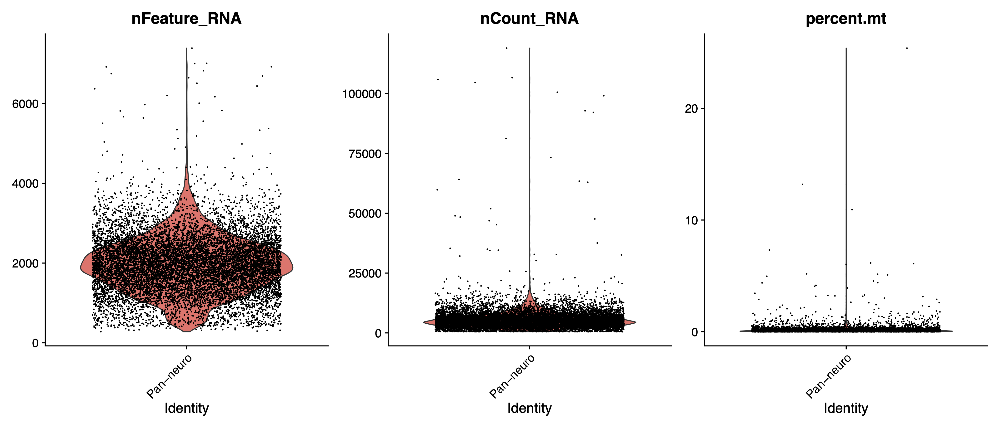
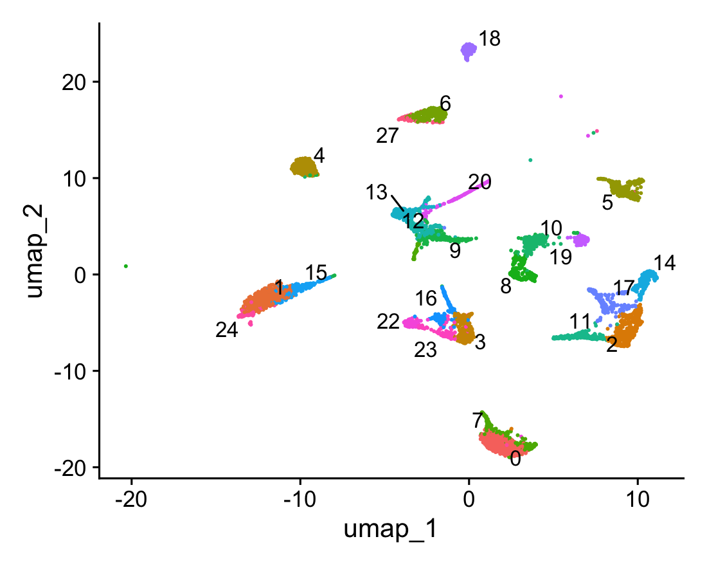
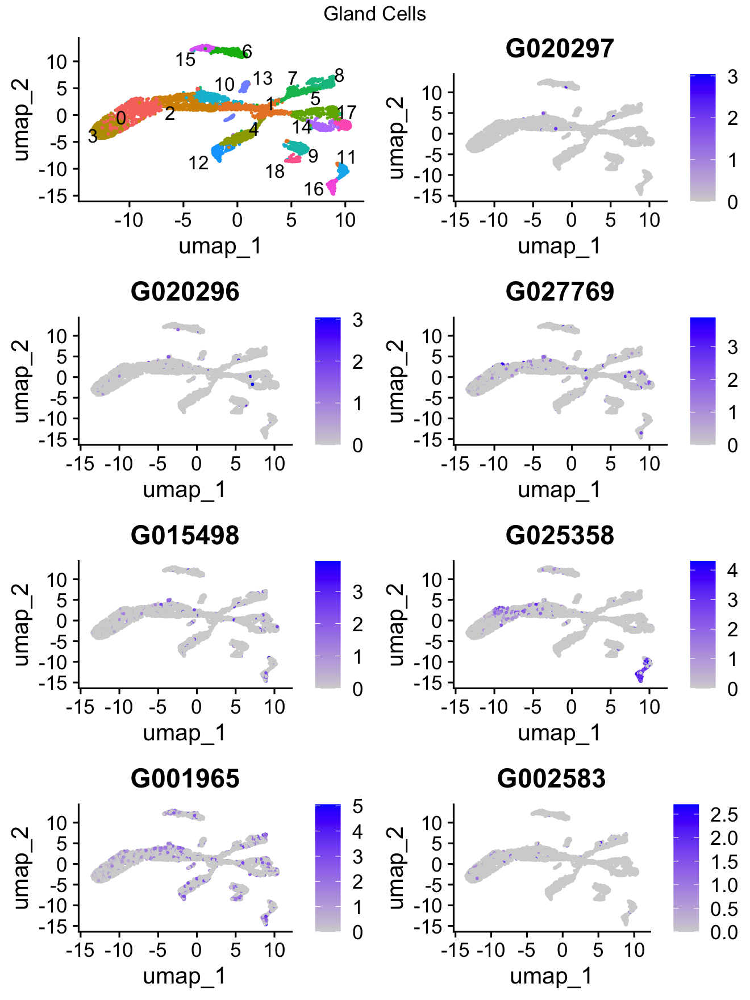
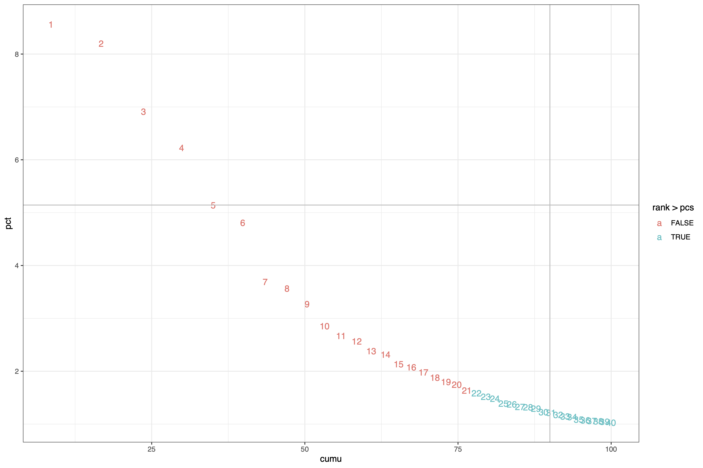
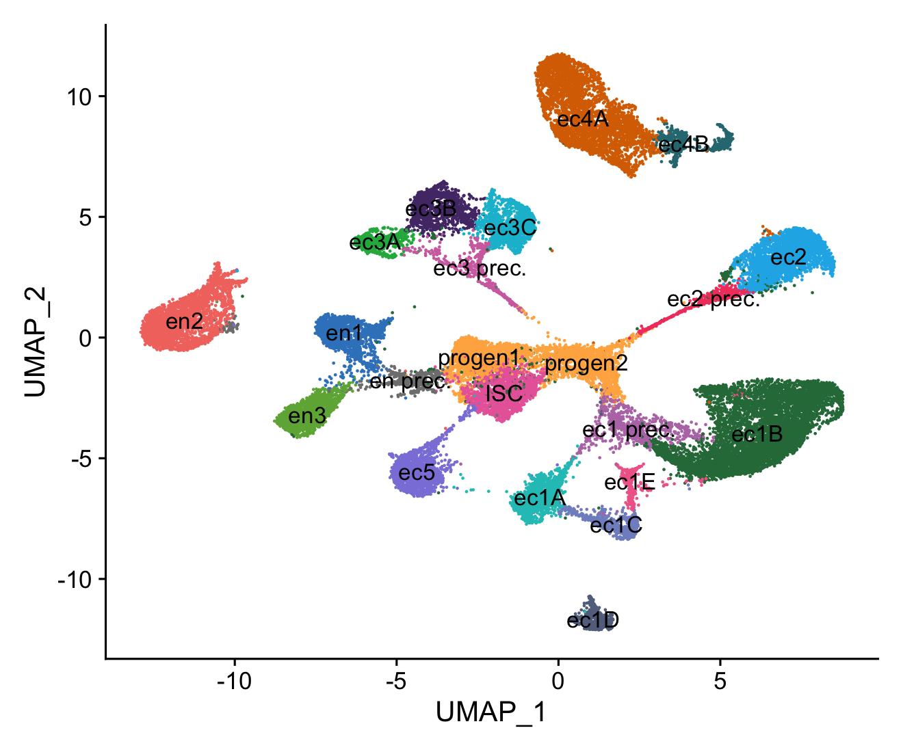
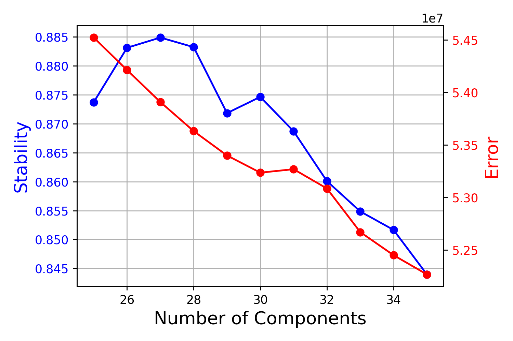
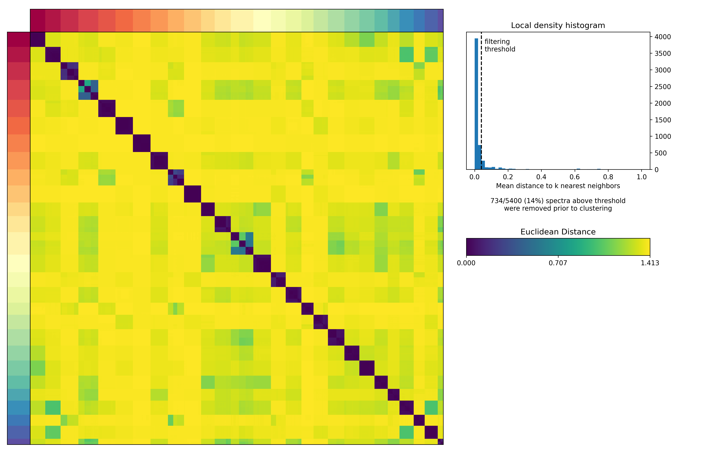

```{r setup, include=FALSE}
knitr::opts_chunk$set(echo = TRUE)
```

This document covers the mapping of the Neuron Enriched <em>Hydra</em> 10x scRNA-seq data collected for this study to the stain AEP <em>H.vulgaris</em> genome as a reference followed by cluster analysis of this 10x dataset integrated with the neuron Drop-seq data originally published in [Siebert et al. (2019)](https://www.science.org/doi/10.1126/science.aav9314) (raw data available [here](https://www.ncbi.nlm.nih.gov/geo/query/acc.cgi?acc=GSE121617)) and re-mapped/re-analyzed in [Cazet et al. (2023)](https://genome.cshlp.org/content/early/2023/02/23/gr.277040.122) (processed data can be downloaded from the 05_hydraAtlasReMap repo on the Hydra AEP Genome Project Portal under the [Scripts and Data tab](https://research.nhgri.nih.gov/HydraAEP/download/index.cgi?dl=fa)). This document covers initial read mapping, cell filtering and QC, clustering, plotting, co-expression analysis, and final annotation of the <em>Hydra</em> Neuron scRNA-seq data. 

**Aligning, Processing, and Analyzing <em>Hydra</em> Neuron 10x scRNA-seq Data**<br>
[Mapping 10x Data to the AEP Assembly Transcriptome](#item-one)<br> 
[QC, Filtering, and Removal of nonNeuronal Cells from 10X single cell libraries](#item-two)<br>
[Initial Integration and Clustering](#item-three)<br>
[Final Integration and Clustering](#item-four)<br>
[Annotating the Hydra Neuron Single Cell Atlas](#item-five)<br>
[Identifying Gene Co-Expression Programs Using Non-Negative Matrix Factorization](#item-six)<br>
[Interactive 3D UMAP of Final Hydra Neuron Single Cell Atlas](#item-seven)<br>
[Files Associated with this Document](#item-eight)<br>


<!-- headings -->
<a id="item-one"></a>
<h3>Mapping 10x Data to the AEP Assembly Transcriptome</h3>
To map our raw 10x reads to the AEP assembly, we used the Cell Ranger pipeline from 10x Genomics (cellranger v.6.1.1)<br>

First, the 01_mapping/cellranger_mkref.sh script was used to prep the reference files for mapping. We used the transcript sequences for the longest isoforms for each gene (`HVAEP1.tran.longestIso.fa`). We opted to use transcriptomic sequence as opposed to genomic sequence because it eliminated the possibility of mapping to off-target intronic and intergenic regions. We also supplemented these sequences with mitochondrial genes, whose expression levels can provide a useful readout of stress in a cell. The final file was called `HVAEP1.tran.final.mito.fasta`. We provided the gtf file (`HVAEP1.transcriptome.mito.gtf`) as the cellranger pipeline requires a gtf file for the reference sequence, even if it's not a genomic sequence.<br>

(<em>01_mapping/cellranger_mkref.sh</em>)
```
#!/bin/bash -l
#SBATCH --job-name=cellrangerref
#SBATCH -c 12
#SBATCH --mem=10G
#SBATCH -t 1-00:00
#SBATCH --error=logs/10x_ref.err
#SBATCH --output=logs/10x_ref.out

export PATH=/group/julianolab/analyses/dropseq/cellranger-6.1.1:$PATH

cellranger mkref \
--genome=HVAEP1.tran.final.mito.10x.ref \
--fasta=resources/HVAEP1.tran.final.mito.fasta \
--genes=resources/HVAEP1.transcriptome.mito.gtf
```

We used a series of 01/cellranger_count_*.sh scripts to align 10x sequencing reads from individual libraries to the 10x reference transcriptome created by the previous script to produce raw and filtered feature-barcode matrices.<br>

(<em>01_mapping/cellranger_count_bud1.sh</em>)
```
#!/bin/bash -l
#SBATCH --job-name=bud1_10x_count
#SBATCH -c 24
#SBATCH --mem=40G
#SBATCH -t 2-00:00:00
#SBATCH --error=logs/budding_10x_1.err
#SBATCH --output=logs/budding_10x_1.out


# ======================================== #
### DEFINE PATHS NEEDED FOR THE PIPELINE ###
# ======================================== #

export PATH=/group/julianolab/analyses/dropseq/cellranger-6.1.1:$PATH

cellranger count \
--id=budding1_10x_HVAEP1_tran_final \
--fastqs=raw_data/budding_fastq/ \
--sample=ACTIN_GFP_1 \
--transcriptome=HVAEP1.tran.final.mito.10x.ref/ \
```
(<em>01_mapping/cellranger_count_bud2.sh</em>)
```
#!/bin/bash -l
#SBATCH --job-name=bud2_10x_count
#SBATCH -c 24
#SBATCH --mem=40G
#SBATCH -t 2-00:00:00
#SBATCH --error=logs/budding_10x_2.err
#SBATCH --output=logs/budding_10x_2.out


# ======================================== #
### DEFINE PATHS NEEDED FOR THE PIPELINE ###
# ======================================== #

export PATH=/group/julianolab/analyses/dropseq/cellranger-6.1.1:$PATH

cellranger count \
--id=budding2_10x_HVAEP1_tran_final \
--fastqs=raw_data/budding_fastq/ \
--sample=ACTIN_GFP_2 \
--transcriptome=HVAEP1.tran.final.mito.10x.ref/ \
```
(<em>01_mapping/cellranger_count_nG.sh</em>)
```
#!/bin/bash -l
#SBATCH --job-name=nG10x_count
#SBATCH -c 24
#SBATCH --mem=40G
#SBATCH -t 2-00:00:00
#SBATCH --error=logs/nG_10x.err
#SBATCH --output=logs/nG_10x.out


# ======================================== #
### DEFINE PATHS NEEDED FOR THE PIPELINE ###
# ======================================== #

export PATH=/group/julianolab/analyses/dropseq/cellranger-6.1.1:$PATH

cellranger count \
--id=nGreen_10x_HVAEP1_tran_final \
--fastqs=raw_data/ACTIN_GFP_fastqs/ \
--transcriptome=HVAEP1.tran.final.mito.10x.ref/ \
```
(<em>01_mapping/cellranger_count_PN.sh</em>)
```
#!/bin/bash -l
#SBATCH --job-name=PN_10x_count
#SBATCH -c 24
#SBATCH --mem=40G
#SBATCH -t 2-00:00:00
#SBATCH --error=logs/PN_10x.err
#SBATCH --output=logs/PN_10x.out


# ======================================== #
### DEFINE PATHS NEEDED FOR THE PIPELINE ###
# ======================================== #

export PATH=/group/julianolab/analyses/dropseq/cellranger-6.1.1:$PATH

cellranger count \
--id=PN_10x_HVAEP1_tran_final \
--fastqs=raw_data/PN_fastqs/ \
--transcriptome=HVAEP1.tran.final.mito.10x.ref/ \
```
An average overall transcriptome alignment rate of 59.9% was obtained (PN 62.5%, nGreen 58.6%, nGreen budding1 60.4%, nGreen budding2 58.1%). 


<!-- headings -->
<a id="item-two"></a>
<h3>QC, Filtering, and Removal of nonNeuronal Cells from 10X single cell libraries</h3>

We imported the mapped 10x scRNA-seq data as well the subsetted drop-seq data collected from Siebert et al. 2019 and realigned to the AEP genome in Cazet et al 2023 into Seurat (v4.0.5) for downstream cluster analysis and cell type annotation. All of this was done within one large R script (hydra.neuronSeurat.R). For the purposes of this document, we have broken this script into chunks to simplify the explanation process.<br>

We imported the 10x scRNA-seq data from the filtered_feature_bc_matrix folder for each 10x library and the subsetted drop-seq data collected from Siebert et al. 2019 and realigned to the AEP genome in Cazet et al 2023 into Seurat (v4.0.5). We performed initial filtering to remove low quality cells by by removing barcodes with fewer than 300 or greater than 7,000 unique molecular identifiers (UMIs), or fewer than 500 or greater than 50,000 reads, or greater than 5% mitochondrial reads.<br>

(snippet from <em>02_clust/hydra.neuronSeurat.R</em>)
<!-- Figure out directory structure -->
<!-- Figure out where in the directory to put the ds neuro object -->

```{r, echo=TRUE, eval=FALSE}
# Load packages and set working directory ---------------------------------------------------
# Load packages. This only needs to be done once. 

library(tidyverse)
library(Seurat)
library(grid)
library(gridExtra)
library(ggplot2)
library(patchwork)
library(ggtext)
library(rstudioapi)
library(dplyr)

# Set working directory to the path this script is in
setwd(dirname(getActiveDocumentContext()$path))

# Load raw matrix from each single cell library ----------------------------------------------------

# Here, we are loading the filtered_feature_bc_matrix folder for each 10x library as well the subsetted drop-seq data collected from Siebert et al. 2019 and realigned to the AEP genome in Cazet et al 2023. 10x matrixes were generated by the "cellranger count" function in commandline 

#Load the 10x data from the Tg(actin1:GFP) budding_1 library
nGreen_budding1_10x <-Read10X(data.dir = "unprocessed_data/budding1_filtered_feature_bc_matrix/")
#Remove HVAEP1_ prefix from gene names
nGreen_budding1_10x@Dimnames[[1]] <- gsub("HVAEP1_", "", nGreen_budding1_10x@Dimnames[[1]])

#Load the 10x data from the Tg(actin1:GFP) budding_2 library
nGreen_budding2_10x <-Read10X(data.dir = "unprocessed_data/budding2_filtered_feature_bc_matrix/")
#Remove HVAEP1_ prefix from gene names
nGreen_budding2_10x@Dimnames[[1]] <- gsub("HVAEP1_", "", nGreen_budding2_10x@Dimnames[[1]])

#Load the 10x data from the Tg(tba1c:mNeonGreen) library
PN_10x <-Read10X(data.dir = "unprocessed_data/tba1c_filtered_feature_bc_matrix/")
#Remove HVAEP1_ prefix from gene names
PN_10x@Dimnames[[1]] <- gsub("HVAEP1_", "", PN_10x@Dimnames[[1]])

#Load the 10x data from the Tg(actin1:GFP) non-budding library
nGreen_10x <-Read10X(data.dir ="unprocessed_data/nonbudding_filtered_feature_bc_matrix/")
#Remove HVAEP1_ prefix from gene names
nGreen_10x@Dimnames[[1]] <- gsub("HVAEP1_", "", nGreen_10x@Dimnames[[1]])

#Load subset from the previously published drop-seq data (Siebert et al. 2019). This table contains cells subsetted from the whole animal data set and contains interstitial stem cells, neuronal progentiors, and differented neurons
ds.neuro.cells <- read.table(file = "unprocessed_data/dsNeuroCells.tsv", sep = '\t', header = TRUE)
#Remove HVAEP1- prefix from gene names
rownames(ds.neuro.cells) <- gsub("HVAEP1-", "", rownames(ds.neuro.cells) )


# Next we will perform an initial quality control for each library

# 10x nGreen non-budding Quality Control -------------------------------------------------

# Individual Seurat objects were generated from each library and were filtered as previously described to retain cells with between 300 - 7,000 uniquely expressed genes, 500 - 50,000 transcripts, and less than 5% mitochondrial reads (Satija et al., 2015; Siebert et al., 2019).

# Create Seurat object with the raw counts, keeping all genes expressed in 3 or more cells and all cells with 200 or more transcripts
nGreen_10x_raw <- CreateSeuratObject(counts = nGreen_10x, project = "neonGreen", min.cells = 3, min.features = 200)

# Calculate percentage of mitochondrial reads per cell and add data to Suerat object
# The [[ operator can add columns to object metadata. This is a great place to stash QC stats
nGreen_10x_raw[["percent.mt"]] <- PercentageFeatureSet(nGreen_10x_raw, pattern = "^MT-")

# Visualize QC metrics as a violin plot, saved 6 x 14 nG_vlnplot_presubset
VlnPlot(nGreen_10x_raw, features = c("nFeature_RNA", "nCount_RNA", "percent.mt"), ncol = 3)

```

<!-- You need to dump all these images in a resources folder within the project directory (not indiv analysis directory)-->

```{r, echo=TRUE, eval=FALSE}
# Quantify how many cells are over 5% mt? 2 cells
count(nGreen_10x_raw[["percent.mt"]], percent.mt > 5)

# Subset cells that have between 300 - 7,000 unique features (genes), between 500 - 50,000 counts (transcripts), and less than 5% mitochondrial reads
nGreen <- subset(nGreen_10x_raw, subset = nFeature_RNA > 300 & nFeature_RNA < 7000 & nCount_RNA > 500 & nCount_RNA < 50000 & percent.mt < 5)

```
<!-- Don't include the saveRDS-->
```{r, echo=TRUE, eval=FALSE}
# 10x nGreen budding_1 Quality Control -------------------------------------------------

# Individual Seurat objects were generated from each library and were filtered as previously described to retain cells with between 300 - 7,000 uniquely expressed genes, 500 - 50,000 transcripts, and less than 5% mitochondrial reads (Satija et al., 2015; Siebert et al., 2019).

# Create Seurat object with the raw counts, keeping all genes expressed in 3 or more cells and all cells with 200 or more transcripts 
nGreen_budding1_10x_raw <- CreateSeuratObject(counts = nGreen_budding1_10x, project = "budding1", min.cells = 3, min.features = 200)

# Calculate percentage of mitochondrial reads per cell and add data to Suerat object
# The [[ operator can add columns to object metadata. This is a great place to stash QC stats
nGreen_budding1_10x_raw[["percent.mt"]] <- PercentageFeatureSet(nGreen_budding1_10x_raw, pattern = "^MT-")

# Visualize QC metrics as a violin plot, saved 6 x 14 budding1_vlnplot_presubset
VlnPlot(nGreen_budding1_10x_raw, features = c("nFeature_RNA", "nCount_RNA", "percent.mt"), ncol = 3)
```


```{r, echo=TRUE, eval=FALSE}
# Quantify how many cells are over 5% mt? 186 cells
count(nGreen_budding1_10x_raw[["percent.mt"]], percent.mt > 5)

# Subset cells that have between 300 - 7,000 unique features (genes), between 500 - 50,000 counts (transcripts), and less than 5% mitochondrial reads
nGreen_budding1 <- subset(nGreen_budding1_10x_raw, subset = nFeature_RNA > 300 & nFeature_RNA < 7000 & nCount_RNA > 500 & nCount_RNA < 50000 & percent.mt < 5)

```

```{r, echo=TRUE, eval=FALSE}
# Create Seurat object with the raw counts, keeping all genes expressed in 3 or more cells and all cells with 200 or more transcripts
nGreen_budding2_10x_raw <- CreateSeuratObject(counts = nGreen_budding2_10x, project = "budding2", min.cells = 3, min.features = 200)

# Calculate percentage of mitochondrial reads per cell and add data to Suerat object
# The [[ operator can add columns to object metadata. This is a great place to stash QC stats
nGreen_budding2_10x_raw[["percent.mt"]] <- PercentageFeatureSet(nGreen_budding2_10x_raw, pattern = "^MT-")

# Visualize QC metrics as a violin plot, saved 6 x 14 budding2_vlnplot_presubset
VlnPlot(nGreen_budding2_10x_raw, features = c("nFeature_RNA", "nCount_RNA", "percent.mt"), ncol = 3)
```

```{r, echo=TRUE, eval=FALSE}
# Quantify how many cells are over 5% mt? 173 cells
count(nGreen_budding2_10x_raw[["percent.mt"]], percent.mt > 5)

# Subset cells that have between 300 - 7,000 unique features (genes), between 500 - 50,000 counts (transcripts), and less than 5% mitochondrial reads
nGreen_budding2 <- subset(nGreen_budding2_10x_raw, subset = nFeature_RNA > 300 & nFeature_RNA < 7000 & nCount_RNA > 500 & nCount_RNA < 50000 & percent.mt < 5)

```

```{r, echo=TRUE, eval=FALSE}
# 10x Pan neuronal Quality Control -------------------------------------------------

# Individual Seurat objects were generated from each library and were filtered as previously described to retain cells with between 300 - 7,000 uniquely expressed genes, 500 - 50,000 transcripts, and less than 5% mitochondrial reads (Satija et al., 2015; Siebert et al., 2019).

# Create Seurat object with the raw counts, keeping all genes expressed in 3 or more cells and all cells with 200 or more transcripts
PN_raw <- CreateSeuratObject(counts = PN_10x, project = "Pan-neuro", min.cells = 3, min.features = 200)

# Calculate percentage of mitochondrial reads per cell and add data to Suerat object
# The [[ operator can add columns to object metadata. This is a great place to stash QC stats
PN_raw[["percent.mt"]] <- PercentageFeatureSet(PN_raw, pattern = "^MT-")

# Visualize QC metrics as a violin plot, saved 6 x 14 PN_vlnplot_presubset
VlnPlot(PN_raw, features = c("nFeature_RNA", "nCount_RNA", "percent.mt"), ncol = 3)
```

```{r, echo=TRUE, eval=FALSE}
# Quantify how many cells are over 5% mt? 10 cells
count(PN_raw[["percent.mt"]], percent.mt > 5)

# Subset cells that have between 300 - 7,000 unique features (genes), between 500 - 50,000 counts (transcripts), and less than 5% mitochondrial reads
PN <- subset(PN_raw, subset = nFeature_RNA > 300 & nFeature_RNA < 7000 & nCount_RNA > 500 & nCount_RNA < 50000 & percent.mt < 5)

```

```{r, echo=TRUE, eval=FALSE}
# Drop-seq Quality Control  ----------------------------------------------

# Individual Seurat objects were generated from each library and were filtered as previously described to retain cells with between 300 - 7,000 uniquely expressed genes, 500 - 50,000 transcripts, and less than 5% mitochondrial reads (Satija et al., 2015; Siebert et al., 2019).

# Before we create our Seurat object, we must change the naming scheme of the cell identity so that each name is separated by an underscore instead of a mix of periods and underscores

# Using regular expression, change all of the periods to underscores in the column names
names(ds.neuro.cells) <- gsub("[:.:]", "_", names(ds.neuro.cells))

# Create Seurat object with the raw counts, keeping all genes expressed in 3 or more cells and all cells with 200 or more transcripts. We indicate that the library each cell originated from is located in fields 2:4, and the naming fields are seperated by underscores. 
ds.neuro_raw <- CreateSeuratObject(counts = ds.neuro.cells, project = "dropseq", names.field = 2:4, names.delim = "_", min.cells = 3, min.features = 200)

# Calculate percentage of mitochondrial reads per cell and add data to Suerat object
# The [[ operator can add columns to object metadata. This is a great place to stash QC stats
ds.neuro_raw[["percent.mt"]] <- PercentageFeatureSet(ds.neuro_raw, pattern = "^MT-")

# Visualize QC metrics as a violin plot, saved 6 x 14 dsNeuro_vlnplot_presubset
VlnPlot(ds.neuro_raw, features = c("nFeature_RNA", "nCount_RNA", "percent.mt"), ncol = 3)
```


```{r, echo=TRUE, eval=FALSE}
# Quantify how many cells are over 5% mt? none
count(ds.neuro_raw[["percent.mt"]], percent.mt > 5)

# Subset cells that have between 300 - 7,000 unique features (genes), between 500 - 50,000 counts (transcripts), and less than 5% mitochondrial reads
ds.neuro <- subset(ds.neuro_raw, subset = nFeature_RNA > 300 & nFeature_RNA < 7000 & nCount_RNA > 500 & nCount_RNA < 50000 & percent.mt < 5)

```

We then performed a basic cluster analysis of the four new 10X libraries by performing Louvain clustering on the filtered objects and generating UMAPs for each. Next we sought to remove any cells that were neither a neuronal type cell (neural progenitors/precursors and differentiated neurons) nor interstitial stem cells (ISCs), the stem cell population neurons are derived from in <em>Hydra</em>. First, neuronal clusters and ISCs were identified using the following markers: <em>elav2</em> (G004515) neurons and neural progenitors marker, <em>tba1c</em> (G019559) pan-neuronal marker, and <em>hy-icell1</em> (G002332) ISC marker. We identified clusters lacking any of the neuronal/ISC markers in the libraries collected from Tg(actin1:GFP)<sup>rs3-in</sup> (formerly named nGreen/neuronGreen) animals (libraries nGreen, nGreen_budding1, nGreen_budding2). Tg(actin1:GFP)<sup>rs3-in</sup> animals contain a small population of GFP+ nematocytes and gland cells in addition to GFP+ neurons. We plotted known nematocyte and gland markers identified in Siebert 2019 and all four 10X libraries despite the expectation that no gland/nemato cells should be present in pan-neuronal (PN) library derived from Tg(tba1c:mNeonGreen)<sup>cj1-g</sup>. Non-neuronal cell types were removed from each library for downstream integration and clustering. <br>


Seurat objects were renamed at this point:<br>
-nGreen_budding1 is now <strong>budding1</strong><br>
-nGreen_budding2 is now <strong>budding2</strong><br>
-nGreen is now <strong>nG</strong><br>
-Pan-neuro is now <strong>PN</strong><br>

<strong>Removal of non-neuronal cells from neuronGreen (nG) library</strong><br>

(snippet from <em>02_clust/hydra.neuronSeurat.R</em>)
```{r, echo=TRUE, eval=FALSE}
# Initial clustering nGreen non-budding + removing clusters cl 15, 18, 21 ---------------------------------------
# Because the nGreen transgenic line contains a small population of transgenic nematocytes and gland cells in addition to neurons, we performed a basic cluster analysis of the three libraries collected using Tg(actin1:GFP)rs3-in/nGreen animals. After clustering, expression plots of nematocyte and gland cell molecular markers (identified in (Siebert et al., 2019)) were generated and any clusters expressing those markers were removed.

nG <- NormalizeData(nG, normalization.method = "LogNormalize", scale.factor = 10000)

nG <- FindVariableFeatures(nG, selection.method = "vst", verbose = TRUE)

all.genes <- rownames(nG)
nG <- ScaleData(nG, features = all.genes)

nG <- RunPCA(nG, features = VariableFeatures(object = nG))
ElbowPlot(nG)
nG <- FindNeighbors(nG, dims = 1:10)
nG <- FindClusters(nG, recution.type = "pca", dims.use = 1:10, resolution = 0.9)
nG <- RunUMAP(nG, dims = 1:10)

# Progenitor and neuron markers 
p1 <- DimPlot(nG, reduction = "umap", label = TRUE) + NoLegend()
p2 <- FeaturePlot(nG, "G002332", label = F) # HyIcell
p3 <- FeaturePlot(nG, "G004515", label = F) # elav2 - all neural cell types
p4 <- FeaturePlot(nG, "G019559", label = F) # tba1c - differentiated neurons
grid.arrange(p1, p2, p3, p4, ncol=2)
```

```{r, echo=TRUE, eval=FALSE}
# Nemato Clusters 
p1 <- DimPlot(nG, reduction = "umap", label = TRUE) + NoLegend()
p2 <- FeaturePlot(nG, "G023536", label = F)
p3 <- FeaturePlot(nG, "G021814", label = F)
p4 <- FeaturePlot(nG, "G028500", label = F)
p5 <- FeaturePlot(nG, "G006709", label = F)
p6 <- FeaturePlot(nG, "G005522", label = F)
p7 <- FeaturePlot(nG, "G012451", label = F)
p8 <- FeaturePlot(nG, "G008423", label = F)
p9 <- FeaturePlot(nG, "G016939", label = F)
p10 <- FeaturePlot(nG, "G007115", label = F)
p11 <- FeaturePlot(nG, "G019581", label = F)
p12 <- FeaturePlot(nG, "G014365", label = F)
grid.arrange(p1, p2, p3, p4, p5, p6, p7, p8, p9, p10, p11, p12, ncol=3,top="Nematocytes/Nematoblasts")
grid.arrange(p1, p12, ncol=2,top="Nematocytes/Nematoblasts")
```


```{r, echo=TRUE, eval=FALSE}
# Gland Cluster 
p1 <- DimPlot(nG, reduction = "umap", label = TRUE) + NoLegend()
p2 <- FeaturePlot(nG, "G020297", label = F)
p3 <- FeaturePlot(nG, "G020296", label = F)
p4 <- FeaturePlot(nG, "G027769", label = F)
p5 <- FeaturePlot(nG, "G015498", label = F)
p6 <- FeaturePlot(nG, "G025358", label = F)
p7 <- FeaturePlot(nG, "G001965", label = F)
p8 <- FeaturePlot(nG, "G002583", label = F)
grid.arrange(p1, p2, p3, p4, p5, p6, p7, p8, ncol=2,top="Gland Cells")
```

nG clusters 15 and 21 express known nematocyte markers and nG cluster 18 expresses gland cell markers and no neuronal markers. We removed cells from clusters 15, 18, and 21 for downstream data integration.<br>

(snippet from <em>02_clust/hydra.neuronSeurat.R</em>)
```{r, echo=TRUE, eval=FALSE}
# subset out 15, 18, 21
levels(nG)
clusters_to_subset_nG <- c("0", "1", "2", "3", "4", "5", "6", "7", "8", "9", "10", "11", "12", "13", "14", "16", "17", "19", "20")

nG_sub <- subset(nG, idents = clusters_to_subset_nG)
levels(nG_sub)
DimPlot(nG_sub, reduction = "umap", label = TRUE) + NoLegend()
```

<strong>Removal of non-neuronal cells from neuronGreen budding1 (budding1) library</strong><br>

(snippet from <em>02_clust/hydra.neuronSeurat.R</em>)
```{r, echo=TRUE, eval=FALSE}
# Initial clustering Budding1 + removing clusters 21, 22, 24, 27 ---------------------------------------
budding1 <- NormalizeData(budding1, normalization.method = "LogNormalize", scale.factor = 10000)

budding1 <- FindVariableFeatures(budding1, selection.method = "vst", verbose = TRUE)

all.genes <- rownames(budding1)
budding1 <- ScaleData(budding1, features = all.genes)

budding1 <- RunPCA(budding1, features = VariableFeatures(object = budding1))
ElbowPlot(budding1)
budding1 <- FindNeighbors(budding1, dims = 1:12)
budding1 <- FindClusters(budding1, recution.type = "pca", dims.use = 1:12, resolution = 1.3)
budding1 <- RunUMAP(budding1, dims = 1:12)

# Progenitor and neuron markers 
p1 <- DimPlot(budding1, reduction = "umap", label = TRUE, repel = T) + NoLegend()
p2 <- FeaturePlot(budding1, "G002332", label = F) # HyIcell
p3 <- FeaturePlot(budding1, "G004515", label = F) # elav2 - all neural cell types
p4 <- FeaturePlot(budding1, "G019559", label = F) # tba1c - differentiated neurons
grid.arrange(p1, p2, p3, p4, ncol=2)
```


```{r, echo=TRUE, eval=FALSE}
# Nemato Clusters
p1 <- DimPlot(budding1, reduction = "umap", label = TRUE, repel = T) + NoLegend()
p2 <- FeaturePlot(budding1, "G023536", label = F)
p3 <- FeaturePlot(budding1, "G021814", label = F)
p4 <- FeaturePlot(budding1, "G028500", label = F)
p5 <- FeaturePlot(budding1, "G006709", label = F)
p6 <- FeaturePlot(budding1, "G005522", label = F)
p7 <- FeaturePlot(budding1, "G012451", label = F)
p8 <- FeaturePlot(budding1, "G008423", label = F)
p9 <- FeaturePlot(budding1, "G016939", label = F)
p10 <- FeaturePlot(budding1, "G007115", label = F)
p11 <- FeaturePlot(budding1, "G019581", label = F)
p12 <- FeaturePlot(budding1, "G014365", label = F)
grid.arrange(p1, p2, p3, p4, p5, p6, p7, p8, p9, p10, p11, p12, ncol=3,top="Nematocytes/Nematoblasts")
```


```{r, echo=TRUE, eval=FALSE}
# Gland Cluster
p1 <- DimPlot(budding1, reduction = "umap", label = TRUE, repel = T) + NoLegend()
p5 <- FeaturePlot(budding1, "G015498", label = F)
p6 <- FeaturePlot(budding1, "G025358", label = F)
p7 <- FeaturePlot(budding1, "G001965", label = F)
p8 <- FeaturePlot(budding1, "G002583", label = F)
grid.arrange(p1, p5, p6, p7, p8, ncol=3,top="Gland Cells")
```

To further investigate cluster 22 (126 cells) we found molecular markers for the cluster using the `Seurat::FindMarkers` function to identify markers with positive expression in at least 25% of cells in that cluster. We plotted the top 5 markers on the whole <em>Hydra</em> Seurat object which can be downloaded [here](https://research.nhgri.nih.gov/HydraAEP/download/scriptsdata/05_hydraAtlasReMap.tar.gz)). The expression patterns of the top 5 cluster 22 molecular markers are ubiquitously expressed in the whole <em>Hydra</em> dataset including the epithelial cells. The genes contributing to the clustering of cluster 22 are likely representative of stress (supported by evidence of a mitochondrial gene (MT-16S) as one of the top markers for the cluster). Therefore, we removed the cells in cluster 22 from the budding1 Seurat object for downstream analysis. <br>

(snippet from <em>02_clust/hydra.neuronSeurat.R</em>)
```{r, echo=TRUE, eval=FALSE}
# Find and plot markers for cluster budding1 cluster 22 on whole animal data (Siebert 2019, Cazet 2023)
cluster22.markers <- FindMarkers(budding1, ident.1 = 22, min.pct = 0.25, only.pos = TRUE)
genes <- row.names(head(cluster22.markers, 6)) #MT-16S not found in whole animal data. Remove from list, but note it is a mito marker
genes <- genes[c(1,2,4,5,6)]

# load whole animal dataset (availbale for download here: https://research.nhgri.nih.gov/HydraAEP/download/scriptsdata/05_hydraAtlasReMap.tar.gz)
whole.animal <- readRDS("../../../../scPortal/makeShinyMulti/data/nonDubDsLabeledAllMeta-2.rds")
DefaultAssay(whole.animal) <- "SCT"

p1 <- DimPlot(whole.animal, label = F) + NoLegend() 
p2 <- FeaturePlot(whole.animal, genes[1], order = T, label = F) + NoLegend()
p3 <- FeaturePlot(whole.animal, genes[2], order = T, label = F) + NoLegend()
p4 <- FeaturePlot(whole.animal, genes[3], order = T, label = F) + NoLegend()
p5 <- FeaturePlot(whole.animal, genes[4], order = T, label = F) + NoLegend()
p6 <- FeaturePlot(whole.animal, genes[5], order = T, label = F) + NoLegend()
grid.arrange(p1, p2, p3, p4, p5, p6, ncol=3,top="budding1 cluster 22 Markers")
```

Budding1 clusters 21 and 24 express known nematocyte markers and cluster 27 expresses gland cell markers and no neuronal markers. We removed cells from clusters 21, 24, 27 as well as cluster 22 (which primarily expresses stress gene markers) for downstream data integration.<br>

(snippet from <em>02_clust/hydra.neuronSeurat.R</em>)
```{r, echo=TRUE, eval=FALSE}
# subset out 21, 22, 24, 27
levels(budding1)
clusters_to_subset_bud1 <- c("0", "1", "2",  "3",  "4",  "5",  "6",  "7",  "8", "9",  "10", "11", "12", "13", "14", "15", "16", "17", "18", "19", "20", "23", "25", "26", "28")

budding1_sub <- subset(budding1, idents = clusters_to_subset_bud1)
levels(budding1_sub)
DimPlot(budding1_sub, reduction = "umap", label = TRUE, repel = T) + NoLegend()
```

<strong>Removal of non-neuronal cells from neuronGreen budding2 (budding2) library</strong><br>

(snippet from <em>02_clust/hydra.neuronSeurat.R</em>)
```{r, echo=TRUE, eval=FALSE}
# Initial clustering Budding2 + removing clusters cl 21, 25, 26, 28, 29 -------------------------------
budding2 <- NormalizeData(budding2, normalization.method = "LogNormalize", scale.factor = 10000)

budding2 <- FindVariableFeatures(budding2, selection.method = "vst", verbose = TRUE)

all.genes <- rownames(budding2)
budding2 <- ScaleData(budding2, features = all.genes)

budding2 <- RunPCA(budding2, features = VariableFeatures(object = budding2))
ElbowPlot(budding2)
budding2 <- FindNeighbors(budding2, dims = 1:15)
budding2 <- FindClusters(budding2, recution.type = "pca", dims.use = 1:15, resolution = 1.3)
budding2 <- RunUMAP(budding2, dims = 1:15)

# Progenitor and neuron markers
p1 <- DimPlot(budding2, reduction = "umap", label = TRUE, repel = T) + NoLegend()
p2 <- FeaturePlot(budding2, "G002332", label = F) # HyIcell
p3 <- FeaturePlot(budding2, "G004515", label = F) # elav2 - all neural cell types
p4 <- FeaturePlot(budding2, "G019559", label = F) # tba1c - differentiated neurons
grid.arrange(p1, p2, p3, p4, ncol=2)
```


```{r, echo=TRUE, eval=FALSE}
# Nemato Clusters 
p1 <- DimPlot(budding2, reduction = "umap", label = TRUE, repel = T) + NoLegend()
p2 <- FeaturePlot(budding2, "G023536", label = F)
p3 <- FeaturePlot(budding2, "G021814", label = F)
p4 <- FeaturePlot(budding2, "G028500", label = F)
p5 <- FeaturePlot(budding2, "G006709", label = F)
p6 <- FeaturePlot(budding2, "G005522", label = F)
p7 <- FeaturePlot(budding2, "G012451", label = F)
p8 <- FeaturePlot(budding2, "G008423", label = F)
p9 <- FeaturePlot(budding2, "G016939", label = F)
p10 <- FeaturePlot(budding2, "G007115", label = F)
p11 <- FeaturePlot(budding2, "G019581", label = F)
p12 <- FeaturePlot(budding2, "G014365", label = F)
grid.arrange(p1, p2, p3, p4, p5, p6, p7, p8, p9, p10, p11, p12, ncol=3,top="Nematocytes/Nematoblasts")
```


```{r, echo=TRUE, eval=FALSE}
# Gland Cluster
p1 <- DimPlot(budding2, reduction = "umap", label = TRUE, repel = T) + NoLegend()
p5 <- FeaturePlot(budding2, "G015498", label = F)
p6 <- FeaturePlot(budding2, "G025358", label = F)
p7 <- FeaturePlot(budding2, "G001965", label = F)
p8 <- FeaturePlot(budding2, "G002583", label = F)
grid.arrange(p1, p5, p6, p7, p8, ncol=3,top="Gland Cells")
```

To further investigate cluster 25 (89 cells) we found molecular markers for the cluster using the `Seurat::FindMarkers` function to identify markers with positive expression in at least 25% of cells in that cluster. We found evidence of stress genes (G014159, G027286, MT-16S) among the top markers for cluster 25 and chose to remove the cluster from the seurat object for donwstream analysis. <br>

(snippet from <em>02_clust/hydra.neuronSeurat.R</em>)
```{r, echo=TRUE, eval=FALSE}
# stress cluster 25
cluster25.markers <- FindMarkers(budding2, ident.1 = 25, min.pct = 0.25, only.pos = TRUE)
head(cluster25.markers,10)
```

We found a small cluster (30) of 22 cells in the budding2 library. we found molecular markers for the cluster using the `Seurat::FindMarkers` function to identify markers with positive expression in at least 25% of cells in that cluster. We did not find evidence of previously identified stress markers in cluster 30 so we plotted the top 5 markers on the whole <em>Hydra</em> dataset. The expression patterns of the top 5 cluster 30 molecular markers are primarily epithelial in the whole <em>Hydra</em> dataset. We removed cluster 30 from the dataset for downstream analysis.<br>

(snippet from <em>02_clust/hydra.neuronSeurat.R</em>)
```{r, echo=TRUE, eval=FALSE}
# cluster 30 (22 cells)
cluster30.markers <- FindMarkers(budding2, ident.1 = 30, min.pct = 0.25, only.pos = TRUE)
genes <- row.names(head(cluster30.markers, 10)) #Top clusters are not identified stress markers. Plot top 5

# Plot cluster 30 markers on whole hydra dataset (loaded above)
p1 <- DimPlot(whole.animal, label = F) + NoLegend() 
p2 <- FeaturePlot(whole.animal, genes[1], order = T, label = F) + NoLegend()
p3 <- FeaturePlot(whole.animal, genes[2], order = T, label = F) + NoLegend()
p4 <- FeaturePlot(whole.animal, genes[3], order = T, label = F) + NoLegend()
p5 <- FeaturePlot(whole.animal, genes[4], order = T, label = F) + NoLegend()
p6 <- FeaturePlot(whole.animal, genes[5], order = T, label = F) + NoLegend()
grid.arrange(p1, p2, p3, p4, p5, p6, ncol=3,top="budding1 cluster 30 Markers")
# Top markers for cluster 30 are STRONGLY epithelial, not neuronal. Remove from dataset.
```


Budding2 clusters 21, 28, and 29 express known nematocyte markers and cluster 26 expresses gland cell markers and no neuronal markers. We removed cells from clusters 21, 26, 28, 29 as well as cluster 25 (primarily expresses stress gene markers) and cluster (primarily expressing epithelial markers) for downstream data integration.<br>

(snippet from <em>02_clust/hydra.neuronSeurat.R</em>)
```{r, echo=TRUE, eval=FALSE}
# subset out 21, 25, 26, 28, 29
levels(budding2)
clusters_to_subset_bud2 <- c("0", "1",  "2",  "3",  "4",  "5",  "6",  "7",  "8",  "9",  "10", "11", "12", "13", "14", "15", "16", "17", "18", "19", "20", "22", "23", "24", "27")

budding2_sub <- subset(budding2, idents = clusters_to_subset_bud2)
levels(budding2_sub)
DimPlot(budding2_sub, reduction = "umap", label = TRUE, repel = T) + NoLegend()
```

<strong>Removal of non-neuronal cells from Pan-Neuronal (PN) library</strong><br>

(snippet from <em>02_clust/hydra.neuronSeurat.R</em>)
```{r, echo=TRUE, eval=FALSE}
# Initial clustering PN, no gland/nemato cells in this library ---------------------------------------
PN <- NormalizeData(PN, normalization.method = "LogNormalize", scale.factor = 10000)

PN <- FindVariableFeatures(PN, selection.method = "vst", verbose = TRUE)

all.genes <- rownames(PN)
PN <- ScaleData(PN, features = all.genes)

PN <- RunPCA(PN, features = VariableFeatures(object = PN))
ElbowPlot(PN)
PN <- FindNeighbors(PN, dims = 1:16)
PN <- FindClusters(PN, recution.type = "pca", dims.use = 1:16, resolution = 0.9)
PN <- RunUMAP(PN, dims = 1:16)

# Progenitor and neuron markers
p1 <- DimPlot(PN, reduction = "umap", label = TRUE, repel = T) + NoLegend()
p2 <- FeaturePlot(PN, "G002332", label = F) # HyIcell
p3 <- FeaturePlot(PN, "G004515", label = F) # elav2 - all neural cell types
p4 <- FeaturePlot(PN, "G019559", label = F) # tba1c - differentiated neurons
grid.arrange(p1, p2, p3, p4, ncol=2)
```


```{r, echo=TRUE, eval=FALSE}
# Nemato Clusters 
p1 <- DimPlot(PN, reduction = "umap", label = TRUE, repel = T) + NoLegend()
p2 <- FeaturePlot(PN, "G023536", label = F)
p3 <- FeaturePlot(PN, "G021814", label = F)
p4 <- FeaturePlot(PN, "G028500", label = F)
p5 <- FeaturePlot(PN, "G006709", label = F)
p6 <- FeaturePlot(PN, "G005522", label = F)
p7 <- FeaturePlot(PN, "G012451", label = F)
p8 <- FeaturePlot(PN, "G008423", label = F)
p9 <- FeaturePlot(PN, "G016939", label = F)
p10 <- FeaturePlot(PN, "G007115", label = F)
p11 <- FeaturePlot(PN, "G019581", label = F)
p12 <- FeaturePlot(PN, "G014365", label = F)
grid.arrange(p1, p2, p3, p4, p5, p6, p7, p8, p9, p10, p11, p12, ncol=3,top="Nematocytes/Nematoblasts")
grid.arrange(p1, p12, ncol=2,top="Nematocytes/Nematoblasts")
```


```{r, echo=TRUE, eval=FALSE}
# Gland Cluster 
p1 <- DimPlot(PN, reduction = "umap", label = TRUE, repel = T) + NoLegend()
p2 <- FeaturePlot(PN, "G020297", label = F)
p3 <- FeaturePlot(PN, "G020296", label = F)
p4 <- FeaturePlot(PN, "G027769", label = F)
p5 <- FeaturePlot(PN, "G015498", label = F)
p6 <- FeaturePlot(PN, "G025358", label = F)
p7 <- FeaturePlot(PN, "G001965", label = F)
p8 <- FeaturePlot(PN, "G002583", label = F)
grid.arrange(p1, p2, p3, p4, p5, p6, p7, p8, ncol=2,top="Gland Cells")
```

```{r, echo=TRUE, eval=FALSE}
# PN labeled UMAP
DimPlot(PN, reduction = "umap", label = TRUE) + NoLegend()
```

<strong>Removal of non-neuronal cells from Drop-seq Neuron (ds.neuro) library</strong><br>

(snippet from <em>02_clust/hydra.neuronSeurat.R</em>)
```{r, echo=TRUE, eval=FALSE}
# Initial clustering ds.neuro, no gland/nemato cells in this library ---------------------------------------

ds.neuro <- NormalizeData(ds.neuro, normalization.method = "LogNormalize", scale.factor = 10000)

ds.neuro <- FindVariableFeatures(ds.neuro, selection.method = "vst", verbose = TRUE)

all.genes <- rownames(ds.neuro)
ds.neuro <- ScaleData(ds.neuro, features = all.genes)

ds.neuro <- RunPCA(ds.neuro, features = VariableFeatures(object = ds.neuro))
ElbowPlot(ds.neuro)
ds.neuro <- FindNeighbors(ds.neuro, dims = 1:10)
ds.neuro <- FindClusters(ds.neuro, recution.type = "pca", dims.use = 1:10, resolution = 0.9)
ds.neuro <- RunUMAP(ds.neuro, dims = 1:10)

# Progenitor and neuron markers = budding2_neurons 600x500
p1 <- DimPlot(ds.neuro, reduction = "umap", label = TRUE, repel = T) + NoLegend()
p2 <- FeaturePlot(ds.neuro, "G002332", label = F) # HyIcell
p3 <- FeaturePlot(ds.neuro, "G004515", label = F) # elav2 - all neural cell types
p4 <- FeaturePlot(ds.neuro, "G019559", label = F) # tba1c - differentiated neurons
grid.arrange(p1, p2, p3, p4, ncol=2)
```


```{r, echo=TRUE, eval=FALSE}
# Nemato Clusters
p1 <- DimPlot(ds.neuro, reduction = "umap", label = TRUE, repel = T) + NoLegend()
p2 <- FeaturePlot(ds.neuro, "G023536", label = F)
p3 <- FeaturePlot(ds.neuro, "G021814", label = F)
p4 <- FeaturePlot(ds.neuro, "G028500", label = F)
p5 <- FeaturePlot(ds.neuro, "G006709", label = F)
p6 <- FeaturePlot(ds.neuro, "G005522", label = F)
p7 <- FeaturePlot(ds.neuro, "G012451", label = F)
p8 <- FeaturePlot(ds.neuro, "G008423", label = F)
p9 <- FeaturePlot(ds.neuro, "G016939", label = F)
p10 <- FeaturePlot(ds.neuro, "G007115", label = F)
p11 <- FeaturePlot(ds.neuro, "G019581", label = F)
p12 <- FeaturePlot(ds.neuro, "G014365", label = F)
grid.arrange(p1, p2, p3, p4, p5, p6, p7, p8, p9, p10, p11, p12, ncol=3,top="Nematocytes/Nematoblasts")
grid.arrange(p1, p12, ncol=2,top="Nematocytes/Nematoblasts")
```


```{r, echo=TRUE, eval=FALSE}
# Gland Cluster 
p1 <- DimPlot(ds.neuro, reduction = "umap", label = TRUE, repel = T) + NoLegend()
p2 <- FeaturePlot(ds.neuro, "G020297", label = F)
p3 <- FeaturePlot(ds.neuro, "G020296", label = T)
p4 <- FeaturePlot(ds.neuro, "G027769", label = T)
p5 <- FeaturePlot(ds.neuro, "G015498", label = T)
p6 <- FeaturePlot(ds.neuro, "G025358", label = T)
p7 <- FeaturePlot(ds.neuro, "G001965", label = F)
p8 <- FeaturePlot(ds.neuro, "G002583", label = F)
grid.arrange(p1, p2, p3, p4, p5, p6, p7, p8, ncol=2,top="Gland Cells")
```


```{r, echo=TRUE, eval=FALSE}
DimPlot(ds.neuro, reduction = "umap", label = TRUE, repel = T) + NoLegend()
```


Cell IDs and count data were extracted from the subsetted nGreen nonbudding (nG), budding 1, and budding 2 data and used to create new Seurat objects for nGreen, budding1, and budding2 for downstream analysis. Pan Neuronal (PN) and Drop-seq neuro (ds.neuro) Seurat objects remain the same.<br>

(snippet from <em>02_clust/hydra.neuronSeurat.R</em>)
```{r, echo=TRUE, eval=FALSE}
# Extract cell IDs and make new objects with the "cleaned" data from the nGreen objects -------------------------------------------------

# To extract the cell IDS from object@raw.data, use GetAssayData(object = object, slot = "counts")

budding1_clean <- GetAssayData(object = budding1_sub, slot = "counts")
budding2_clean <- GetAssayData(object = budding2_sub, slot = "counts")
nG_clean <- GetAssayData(object = nG_sub, slot = "counts")

# Make new Seurat objects using the extracted cell IDs

# Budding 1 library

# Create Seurat object with the raw counts, keeping all genes expressed in 3 or more cells and all cells with 200 or more transcripts 
budding1_clean_seur <- CreateSeuratObject(counts = budding1_clean, project = "budding1", min.cells = 3, min.features = 200)

# Calculate percentage of mitochondrial reads per cell and add data to Suerat object
# The [[ operator can add columns to object metadata. This is a great place to stash QC stats
budding1_clean_seur[["percent.mt"]] <- PercentageFeatureSet(budding1_clean_seur, pattern = "^MT-")


# Budding 2 library

# Create Seurat object with the raw counts, keeping all genes expressed in 3 or more cells and all cells with 200 or more transcripts
budding2_clean_seur <- CreateSeuratObject(counts = budding2_clean, project = "budding2", min.cells = 3, min.features = 200)

# Calculate percentage of mitochondrial reads per cell and add data to Suerat object
# The [[ operator can add columns to object metadata. This is a great place to stash QC stats
budding2_clean_seur[["percent.mt"]] <- PercentageFeatureSet(budding2_clean_seur, pattern = "^MT-")


# Non-budding library

# Create Seurat object with the raw counts, keeping all genes expressed in 3 or more cells and all cells with 200 or more transcripts
nG_clean_seur <- CreateSeuratObject(counts = nG_clean, project = "neonGreen", min.cells = 3, min.features = 200, )

# Calculate percentage of mitochondrial reads per cell and add data to Suerat object
# The [[ operator can add columns to object metadata. This is a great place to stash QC stats
nG_clean_seur[["percent.mt"]] <- PercentageFeatureSet(nG_clean_seur, pattern = "^MT-")

```

<!-- headings -->
<a id="item-three"></a>
<h3>Initial Integration and Clustering</h3>

After removing low quality and non-neuronal cells, we integrated these separate Seurat objects using the SCT Integration workflow following SCTransform normalization.<br>

Because the data collected from Siebert 2019 originated from 14 libraries and was input as a single matrix, we first extracted cells from each library from the aggregated object. We generated individual Seurat objects for each of individual Dorp-seq library and added batch information matching the original Siebert 2019 study prefixed with "ds.". We decided to remove drop-seq library ds.06_FM_S1 as it gave errors during preliminary integration. This could perhaps be due to the too few number of cells (contained 68 cells) within the library.<br>

Before normalization, we added a stress module score to each library after identifying genes that seem to be associated with 1) batch effects and 2) stress (e.g. MT-16S, G014159, G027286, G015960, G010241, G009485, G001468, G022617, G021648).<br>

nG and budding Seurat objects were renamed at this point:<br>
-nG is now <strong>nGreen</strong><br>
-budding1 is now <strong>nGreen_budding1</strong><br>
-budding2 is now <strong>nGreen_budding2</strong><br>

(snippet from <em>02_clust/hydra.neuronSeurat.R</em>)
<!-- Don't run this code. Use images provided by Abby -->
```{r, echo=TRUE, eval=FALSE}
# INITIAL DATA INTEGRATION, PCA, AND CLUSTER ANALYSIS ---------------------

# Add in module scores for stress and mitochondrial genes ----------------------------------------------------

# I performed some preliminary cluster analysis and identified a few genes that seem to be associated with 1) batch effects and 2) stress. Thus, I will generate module scores (using the AddModuleScore function in Seurat) for all cells based on this gene set and use these scores to the vars.to.regress argument in SCT transform

stress_genes_list <- list(c("MT-16S",
                            "G014159",
                            "G027286",
                            "G015960",
                            "G010241",
                            "G009485",
                            "G001468",
                            "G022617",
                            "G021648"))

nGreen_budding1 <- AddModuleScore(
  object = nGreen_budding1,
  features = stress_genes_list,
  name = "Stress_genes"
)

nGreen_budding2 <- AddModuleScore(
  object = nGreen_budding2,
  features = stress_genes_list,
  name = "Stress_genes"
)

nGreen <- AddModuleScore(
  object = nGreen,
  features = stress_genes_list,
  name = "Stress_genes"
)

PN <- AddModuleScore(
  object = PN,
  features = stress_genes_list,
  name = "Stress_genes"
)

ds.neuro <- AddModuleScore(
  object = ds.neuro,
  features = stress_genes_list,
  name = "Stress_genes"
)


# Assign batch identities to cells from each library -----------------------------

# Next, we want to assign batch identities to cells from each library so we can look for batch effects and integrate all of the libraries together. We split the larger drop-seq data set into the original 15 libraries. Through preliminary cluster analysis, we also decided to remove drop-seq library D06_FM_S1 (contained 68 cells), because it was giving errors during integration. This could perhaps be due to the too few number of cells within the library

# Because data for each drop-seq library are combined into one matrix, we need to extract cells from each libary and put them into their own objects. 

# Here, we are subsetting cells from each drop-seq library from the larger drop-seq matrix into their own objects
dsp1 <- rownames(ds.neuro@meta.data)[ds.neuro@meta.data[,"orig.ident"] == "D01_D1_S1"]
dsp2 <- rownames(ds.neuro@meta.data)[ds.neuro@meta.data[,"orig.ident"] == "D01_P2_S4"]
dsp3 <- rownames(ds.neuro@meta.data)[ds.neuro@meta.data[,"orig.ident"] == "D02_CO_S2"]
dsp4 <- rownames(ds.neuro@meta.data)[ds.neuro@meta.data[,"orig.ident"] == "D02_P1_S3"]
dsp5 <- rownames(ds.neuro@meta.data)[ds.neuro@meta.data[,"orig.ident"] == "D02_PB_S4"]
dsp6 <- rownames(ds.neuro@meta.data)[ds.neuro@meta.data[,"orig.ident"] == "D03_KI_S1"]
dsp7 <- rownames(ds.neuro@meta.data)[ds.neuro@meta.data[,"orig.ident"] == "D03_MA_S2"]
dsp8 <- rownames(ds.neuro@meta.data)[ds.neuro@meta.data[,"orig.ident"] == "D03_FM_S3"]
dsp9 <- rownames(ds.neuro@meta.data)[ds.neuro@meta.data[,"orig.ident"] == "D06_FM_S1"]
dsp10 <- rownames(ds.neuro@meta.data)[ds.neuro@meta.data[,"orig.ident"] == "D06_MA_S3"]
dsp11 <- rownames(ds.neuro@meta.data)[ds.neuro@meta.data[,"orig.ident"] == "D06_KI_S4"]
dsp12 <- rownames(ds.neuro@meta.data)[ds.neuro@meta.data[,"orig.ident"] == "D11_PO_S1"]
dsp13 <- rownames(ds.neuro@meta.data)[ds.neuro@meta.data[,"orig.ident"] == "D11_BU_S2"]
dsp14 <- rownames(ds.neuro@meta.data)[ds.neuro@meta.data[,"orig.ident"] == "D12_N1_S1"]
dsp15 <- rownames(ds.neuro@meta.data)[ds.neuro@meta.data[,"orig.ident"] == "D12_N2_S2"]

D01_D1_S1 <- subset(ds.neuro, cells = dsp1)
D01_D1_S1@meta.data$batch <- "ds.01_D1"

D01_P2_S4 <- subset(ds.neuro, cells = dsp2)
D01_P2_S4@meta.data$batch <- "ds.01_P2"

D02_CO_S2 <- subset(ds.neuro, cells = dsp3)
D02_CO_S2@meta.data$batch <- "ds.02_CO"

D02_P1_S3 <- subset(ds.neuro, cells = dsp4)
D02_P1_S3@meta.data$batch <- "ds.02_P1"

D02_PB_S4 <- subset(ds.neuro, cells = dsp5)
D02_PB_S4@meta.data$batch <- "ds.02_PB"

D03_KI_S1 <- subset(ds.neuro, cells = dsp6)
D03_KI_S1@meta.data$batch <- "ds.03_KI"

D03_MA_S2 <- subset(ds.neuro, cells = dsp7)
D03_MA_S2@meta.data$batch <- "ds.03_MA"

D03_FM_S3 <- subset(ds.neuro, cells = dsp8)
D03_FM_S3@meta.data$batch <- "ds.03_FM"

D06_FM_S1 <- subset(ds.neuro, cells = dsp9)
D06_FM_S1@meta.data$batch <- "ds.06_FM"

D06_MA_S3 <- subset(ds.neuro, cells = dsp10)
D06_MA_S3@meta.data$batch <- "ds.06_MA"

D06_KI_S4 <- subset(ds.neuro, cells = dsp11)
D06_KI_S4@meta.data$batch <- "ds.06_KI"

D11_PO_S1 <- subset(ds.neuro, cells = dsp12)
D11_PO_S1@meta.data$batch <- "ds.11_PO"

D11_BU_S2 <- subset(ds.neuro, cells = dsp13)
D11_BU_S2@meta.data$batch <- "ds.11_BU"

D12_N1_S1 <- subset(ds.neuro, cells = dsp14)
D12_N1_S1@meta.data$batch <- "ds.12_N1"

D12_N2_S2 <- subset(ds.neuro, cells = dsp15)
D12_N2_S2@meta.data$batch <- "ds.12_N2"

# Here, we are assigning a batch identitiy to cells from each 10x library

nGreen_budding1@meta.data$batch <- "10x.bud1"
nGreen_budding2@meta.data$batch <- "10x.bud2"
nGreen@meta.data$batch <- "10x.nGreen"
PN@meta.data$batch <- "10x.PN"
```

We then normalized each library using SCT Transform, regressing out variables related to the modules scores for the stress genes and the percentage of mitochondrial RNA reads. We used the SCT Integration workflow to create the initial integrated dataset by finding common anchors between all libraries. We used 3000 features for the initial integration.<br>

(snippet from <em>02_clust/hydra.neuronSeurat.R</em>)
```{r, echo=TRUE, eval=FALSE}
# Integrate all single cell data using SCTransform ---------------

# Here we are using the SCT transform function to integrate all data sets by first finding common anchors between all libraries 
# As stated in the section prior, through preliminary cluster analysis we decided to remove drop-seq library D06_FM_S1 (contained 68 cells), because it was giving errors during integration. This could perhaps be due to the too few number of cells within the library

# Combine all single cell RNAseq data sets into a list
all_single_cell_data <- c(nGreen_budding1, nGreen_budding2, nGreen, PN, D01_D1_S1, D01_P2_S4, D02_CO_S2, D02_P1_S3, D02_PB_S4, D03_KI_S1, D03_MA_S2, D03_FM_S3, D06_MA_S3, D06_KI_S4, D11_PO_S1, D11_BU_S2, D12_N1_S1, D12_N2_S2)

# Apply SCT transform to all data sets in the list, regressing out variables related to the modules scores for the stress genes (see section: Add in module scores) as well as percent.mt
all_single_cell_data <- lapply(X = all_single_cell_data, FUN = SCTransform, method = "glmGamPoi", vars.to.regress = c("Stress_genes1", "percent.mt"))

# Choosing top 3000 features to use when integrating the data sets. Features are ranked by the data sets they are found to be variable in
all_single_cell_data_features <- SelectIntegrationFeatures(object.list = all_single_cell_data, nfeatures = 3000)

all_single_cell_data <- PrepSCTIntegration(object.list = all_single_cell_data, anchor.features = all_single_cell_data_features)

# Finds a set of anchors between a list of Seurat objects
all_single_cell_data_anchors <- FindIntegrationAnchors(object.list = all_single_cell_data, normalization.method = "SCT", anchor.features = all_single_cell_data_features)

# Performs dataset integration using anchor set
hydra.neuron.seurat <- IntegrateData(anchorset = all_single_cell_data_anchors, normalization.method = "SCT")
```

We next calculated the first 40 principle components (PCs) of the integrated dataset and plotted the variance explained by each component. This allowed us to estimate the approximate dimensionality of the dataset.<br>

To calculate which PCs we should use (where they start to elbow), we find two data points and take the minimum of those two points:<br>
1) The point where the principal components only contribute 5% of standard deviation and the principal components cumulatively contribute 90% of the standard deviation.
2) The point where the percent change in variation between the consecutive PCs is less than 0.1%.<br>

(snippet from <em>02_clust/hydra.neuronSeurat.R</em>)
```{r, echo=TRUE, eval=FALSE}
# PCA + Cluster Analyses, hydra.integrated.sct --------------------------------------------------

# Next we will perform an initial cluster analysis on the integrated data. This is not so much the step where we care about how the UMAP looks, but rather where we want to weed out non-neuronal cells, such as nematocytes and gland cells which tend to be picked up in the nGreen line. After we perform subsetting and removal of non-neuronal cells, we will recluster the data and then work on making the UMAP pretty

# Here, we will perform PCA on the integrated data. 
# When running sctransform-based workflows, including integration, do not run the ScaleData() function prior to PCA. Note that this single command (SCT) replaces NormalizeData(), ScaleData(), and FindVariableFeatures().
hydra.neuron.seurat <- RunPCA(hydra.neuron.seurat, npcs = 40, verbose = FALSE)

# Determine percent of variation associated with each PC
pct <- hydra.neuron.seurat[["pca"]]@stdev / sum(hydra.neuron.seurat[["pca"]]@stdev) * 100

# Calculate cumulative percents for each PC
cumu <- cumsum(pct)

# Determine which PC exhibits cumulative percent greater than 90% and % variation associated with the PC as less than 5
co1 <- which(cumu > 90 & pct < 5)[1]

#this returns PC # 31
co1

# Determine the difference between variation of PC and subsequent PC to determine the PC where the percent change in variation between consecutive PCs is less than 0.1%:
co2 <- sort(which((pct[1:length(pct) - 1] - pct[2:length(pct)]) > 0.1), decreasing = T)[1] + 1

# last point where change of % of variation is more than 0.1%.
# this returns PC # 25
co2

# Minimum of the two calculation
pcs <- min(co1, co2)

# Create a dataframe with values
plot_df <- data.frame(pct = pct, 
                      cumu = cumu, 
                      rank = 1:length(pct))

# Elbow plot to visualize 
# saved 8 x 12, hydra.neuron.seurat_elbow_plot_percents_initial_clustering
ggplot(plot_df, aes(cumu, pct, label = rank, color = rank > pcs)) + 
  geom_text() + 
  geom_vline(xintercept = 90, color = "grey") + 
  geom_hline(yintercept = min(pct[pct > 5]), color = "grey") +
  theme_bw()
```


For the initial clustering of this integrated dataset, we used the first 25 PCs (calculated as the last point where change of % of variation is more than 0.1%.) to generate a UMAP and to find clusters using the Louvain algorithm with a resolution of 0.8. <br>

(snippet from <em>02_clust/hydra.neuronSeurat.R</em>)
```{r, echo=TRUE, eval=FALSE}
hydra.neuron.seurat <- RunUMAP(hydra.neuron.seurat, reduction = "pca", dims = 1:25)
hydra.neuron.seurat <- FindNeighbors(hydra.neuron.seurat, dim = 1:25)
hydra.neuron.seurat <- FindClusters(hydra.neuron.seurat, resolution = 0.8)

#plot cluster groupings on umap 
DimPlot(hydra.neuron.seurat, reduction = "umap", label = T) + NoLegend()
```


We invested how integrated the data was by plotting umaps colored or split by batch data. 

```{r, echo=TRUE, eval=FALSE}
#Plot batch/library groupings on umap
DimPlot(hydra.neuron.seurat, reduction = "umap", group.by = "batch")
```

```{r, echo=TRUE, eval=FALSE}
#Assess each batch/library contribution to each cluster
DimPlot(hydra.neuron.seurat, reduction = "umap", split.by = "batch", ncol = 6) + NoLegend()
```

To ensure all all non-neuronal cells had been removed from the dataset, we again plotted known molecular markers for nematocytes and gland cells. We did not find any nematocyte or gland cell clusters in the initial integegrated dataset. 

Now that all single cell data sets have been integrated and basic clustering was performed on the integrated object, we plotted nematocyte and gland cell molecular markers and didn't identify any nematocyte or gland cell clusters. We removed cluster 26 from the object after plotting stress genes markers and percent mitochondrial reads. We believe cluster 26 is likely composed of highly stressed cells. <br>

(snippet from <em>02_clust/hydra.neuronSeurat.R</em>)
```{r, echo=TRUE, eval=FALSE}
#Plot percent mitochondrial reads on umap
FeaturePlot(hydra.integrated.sct, "percent.mt", label = T)
```

```{r, echo=TRUE, eval=FALSE}
# Ensure active assay is the SCT assay
DefaultAssay(hydra.neuron.seurat) <- "SCT"


# Plot genes contributing to stress module score on umap
p1 <- FeaturePlot(hydra.neuron.seurat, "G027286") 
p2 <- FeaturePlot(hydra.neuron.seurat, "G014159") 
p3 <- FeaturePlot(hydra.neuron.seurat, "MT-16S") 
p4 <- FeaturePlot(hydra.neuron.seurat, "G015960") 
grid.arrange(p1, p2, p3, p4, ncol=2,top="cl 26 Stres markers")
```

```{r, echo=TRUE, eval=FALSE}
# Remove cluster 26 - "stress cluster"
clusters_to_subset <- c("0",  "1",  "2",  "3",  "4",  "5",  "6",  "7",  "8",  "9",  "10", "11", "12", "13", "14", "15", "16", "17", "18", "19", "20", "21", "22", "23", "24", "25", "27", "28", "29", "30")

hydra.neuron.seurat <- subset(hydra.neuron.seurat, idents = clusters_to_subset)
```

<!-- headings -->
<a id="item-four"></a>
<h3>Final Integration and Clustering</h3>

After arriving at the final set of cells following the removal of non-neuronal and other problematic cells, we performed one last round of integration, PCA, clustering, and UMAP analysis.<br>

(snippet from <em>02_clust/hydra.neuronSeurat.R</em>)
```{r, echo=TRUE, eval=FALSE}
# FINAL DATA INTEGRATION, PCA, AND CLUSTER ANALYSIS ------------------

# Assign batch identities to cells from each library -----------------------------------

#Now that we've removed a non-neural cluster from the initial clustering, we will reintegrate the data. As before, we will extract each library from the integrated seurat object, 

# Switch the active assay to RNA
DefaultAssay(hydra.neuron.seurat) <- "RNA"

# Getting cells from each batch.

dsp1 <- rownames(hydra.neuron.seurat@meta.data)[hydra.neuron.seurat@meta.data[,"orig.ident"] == "D01_D1_S1"]
dsp2 <- rownames(hydra.neuron.seurat@meta.data)[hydra.neuron.seurat@meta.data[,"orig.ident"] == "D01_P2_S4"]
dsp3 <- rownames(hydra.neuron.seurat@meta.data)[hydra.neuron.seurat@meta.data[,"orig.ident"] == "D02_CO_S2"]
dsp4 <- rownames(hydra.neuron.seurat@meta.data)[hydra.neuron.seurat@meta.data[,"orig.ident"] == "D02_P1_S3"]
dsp5 <- rownames(hydra.neuron.seurat@meta.data)[hydra.neuron.seurat@meta.data[,"orig.ident"] == "D02_PB_S4"]
dsp6 <- rownames(hydra.neuron.seurat@meta.data)[hydra.neuron.seurat@meta.data[,"orig.ident"] == "D03_KI_S1"]
dsp7 <- rownames(hydra.neuron.seurat@meta.data)[hydra.neuron.seurat@meta.data[,"orig.ident"] == "D03_MA_S2"]
dsp8 <- rownames(hydra.neuron.seurat@meta.data)[hydra.neuron.seurat@meta.data[,"orig.ident"] == "D03_FM_S3"]
dsp9 <- rownames(hydra.neuron.seurat@meta.data)[hydra.neuron.seurat@meta.data[,"orig.ident"] == "D06_MA_S3"]
dsp10 <- rownames(hydra.neuron.seurat@meta.data)[hydra.neuron.seurat@meta.data[,"orig.ident"] == "D06_KI_S4"]
dsp11 <- rownames(hydra.neuron.seurat@meta.data)[hydra.neuron.seurat@meta.data[,"orig.ident"] == "D11_PO_S1"]
dsp12 <- rownames(hydra.neuron.seurat@meta.data)[hydra.neuron.seurat@meta.data[,"orig.ident"] == "D11_BU_S2"]
dsp13 <- rownames(hydra.neuron.seurat@meta.data)[hydra.neuron.seurat@meta.data[,"orig.ident"] == "D12_N1_S1"]
dsp14 <- rownames(hydra.neuron.seurat@meta.data)[hydra.neuron.seurat@meta.data[,"orig.ident"] == "D12_N2_S2"]
b1 <- rownames(hydra.neuron.seurat@meta.data)[hydra.neuron.seurat@meta.data[,"orig.ident"] == "budding1"]
b2 <- rownames(hydra.neuron.seurat@meta.data)[hydra.neuron.seurat@meta.data[,"orig.ident"] == "budding2"]
nG_tenx <- rownames(hydra.neuron.seurat@meta.data)[hydra.neuron.seurat@meta.data[,"orig.ident"] == "neonGreen"]
PN_tenx <- rownames(hydra.neuron.seurat@meta.data)[hydra.neuron.seurat@meta.data[,"orig.ident"] == "Pan-neuro"]

# Here, we are subsetting cells from each drop-seq library from the larger drop-seq matrix into their own objects
D01_D1_S1 <- subset(hydra.neuron.seurat, cells = dsp1)
D01_D1_S1@meta.data$batch <- "ds.01_D1"

D01_P2_S4 <- subset(hydra.neuron.seurat, cells = dsp2)
D01_P2_S4@meta.data$batch <- "ds.01_P2"

D02_CO_S2 <- subset(hydra.neuron.seurat, cells = dsp3)
D02_CO_S2@meta.data$batch <- "ds.02_CO"

D02_P1_S3 <- subset(hydra.neuron.seurat, cells = dsp4)
D02_P1_S3@meta.data$batch <- "ds.02_P1"

D02_PB_S4 <- subset(hydra.neuron.seurat, cells = dsp5)
D02_PB_S4@meta.data$batch <- "ds.02_PB"

D03_KI_S1 <- subset(hydra.neuron.seurat, cells = dsp6)
D03_KI_S1@meta.data$batch <- "ds.03_KI"

D03_MA_S2 <- subset(hydra.neuron.seurat, cells = dsp7)
D03_MA_S2@meta.data$batch <- "ds.03_MA"

D03_FM_S3 <- subset(hydra.neuron.seurat, cells = dsp8)
D03_FM_S3@meta.data$batch <- "ds.03_FM"

D06_MA_S3 <- subset(hydra.neuron.seurat, cells = dsp9)
D06_MA_S3@meta.data$batch <- "ds.06_MA"

D06_KI_S4 <- subset(hydra.neuron.seurat, cells = dsp10)
D06_KI_S4@meta.data$batch <- "ds.06_KI"

D11_PO_S1 <- subset(hydra.neuron.seurat, cells = dsp11)
D11_PO_S1@meta.data$batch <- "ds.11_PO"

D11_BU_S2 <- subset(hydra.neuron.seurat, cells = dsp12)
D11_BU_S2@meta.data$batch <- "ds.11_BU"

D12_N1_S1 <- subset(hydra.neuron.seurat, cells = dsp13)
D12_N1_S1@meta.data$batch <- "ds.12_N1"

D12_N2_S2 <- subset(hydra.neuron.seurat, cells = dsp14)
D12_N2_S2@meta.data$batch <- "ds.12_N2"

# Extracting the four 10x libraries

#budding1 10x cells
b1ten_x <- subset(hydra.neuron.seurat, cells = b1)
b1ten_x@meta.data$batch <- "10x.bud1"

#budding2 10x cells
b2ten_x <- subset(hydra.neuron.seurat, cells = b2)
b2ten_x@meta.data$batch <- "10x.bud2"

#nGreen 10x cells
nGreen_tenx <- subset(hydra.neuron.seurat, cells = nG_tenx)
nGreen_tenx@meta.data$batch <- "10x.nGreen"

#PN 10x cells
Pan_neuro_tenx <- subset(hydra.neuron.seurat, cells = PN_tenx)
Pan_neuro_tenx@meta.data$batch <- "10x.PN"


# Add in module scores ----------------------------------------------------

# We will assign module scores, as performed above, with the same list of genes associated with 1) batch effects and 2) stress.

stress_genes_list <- list(c("MT-16S",
                            "G014159",
                            "G027286",
                            "G015960",
                            "G010241",
                            "G009485",
                            "G001468",
                            "G022617",
                            "G021648"))

b1ten_x <- AddModuleScore(
  object = b1ten_x,
  features = stress_genes_list,
  name = "Stress_genes"
)

b2ten_x <- AddModuleScore(
  object = b2ten_x,
  features = stress_genes_list,
  name = "Stress_genes"
)

nGreen_tenx <- AddModuleScore(
  object = nGreen_tenx,
  features = stress_genes_list,
  name = "Stress_genes"
)

Pan_neuro_tenx <- AddModuleScore(
  object = Pan_neuro_tenx,
  features = stress_genes_list,
  name = "Stress_genes"
)


# Re-integrate remaining data using SCT -----------------------------------

#combine the data sets
all_single_cell_data <- c(b1ten_x, b2ten_x, nGreen_tenx, Pan_neuro_tenx, D01_D1_S1, D01_P2_S4, D02_CO_S2, D02_P1_S3, D02_PB_S4, D03_KI_S1, D03_MA_S2, D03_FM_S3, D06_MA_S3, D06_KI_S4, D11_PO_S1, D11_BU_S2, D12_N1_S1, D12_N2_S2)

# doing stress genes, can also try batch
all_single_cell_data <- lapply(X = all_single_cell_data, FUN = SCTransform, vars.to.regress = c("Stress_genes1", "percent.mt"))

all_single_cell_data_features <- SelectIntegrationFeatures(object.list = all_single_cell_data, nfeatures = 3000)

all_single_cell_data <- PrepSCTIntegration(object.list = all_single_cell_data, anchor.features = all_single_cell_data_features)

all_single_cell_data_anchors <- FindIntegrationAnchors(object.list = all_single_cell_data, normalization.method = "SCT", anchor.features = all_single_cell_data_features)

hydra.neuron.seurat <- IntegrateData(anchorset = all_single_cell_data_anchors, normalization.method = "SCT")


# Final PCA + Cluster Analyses --------------------------------------------------

# Next we will perform a cluster analysis on the integrated data.

# Here, we will perform PCA on the integrated data. 

# Make sure that the default assay is integrated
DefaultAssay(hydra.neuron.seurat) <- "integrated"

# Run PCA
hydra.neuron.seurat <- RunPCA(hydra.neuron.seurat, npcs = 40, verbose = FALSE)

# To calculate which principal components we should use (where they start to elbow), we find two data points and take their minimum: 
# 1) The point where the principal components only contribute 5% of standard deviation and the principal components cumulatively contribute 90% of the standard deviation.
# 2) The point where the percent change in variation between the consecutive PCs is less than 0.1%.

# Determine percent of variation associated with each PC
pct <- hydra.neuron.seurat[["pca"]]@stdev / sum(hydra.neuron.seurat[["pca"]]@stdev) * 100

# Calculate cumulative percents for each PC
cumu <- cumsum(pct)

# Determine which PC exhibits cumulative percent greater than 90% and % variation associated with the PC as less than 5
co1 <- which(cumu > 90 & pct < 5)[1]

#this returns PC # 31
co1

# Determine the difference between variation of PC and subsequent PC to determine the PC where the percent change in variation between consecutive PCs is less than 0.1%:
co2 <- sort(which((pct[1:length(pct) - 1] - pct[2:length(pct)]) > 0.1), decreasing = T)[1] + 1

# last point where change of % of variation is more than 0.1%.
# this returns PC # 21
co2

# Minimum of the two calculation
pcs <- min(co1, co2)

# Create a dataframe with values
plot_df <- data.frame(pct = pct, 
                      cumu = cumu, 
                      rank = 1:length(pct))

# Elbow plot to visualize 
# saved 8 x 12, hydra.neuron.seurat_elbow_plot_percents
ggplot(plot_df, aes(cumu, pct, label = rank, color = rank > pcs)) + 
  geom_text() + 
  geom_vline(xintercept = 90, color = "grey") + 
  geom_hline(yintercept = min(pct[pct > 5]), color = "grey") +
  theme_bw()

```

After trying several combinations of different PCs, we have opted to use the first 21 PCs for our final clustering with a resolution of 0.8.<br>

(snippet from <em>02_clust/hydra.neuronSeurat.R</em>)
```{r, echo=TRUE, eval=FALSE}
hydra.neuron.seurat <- RunUMAP(hydra.neuron.seurat, reduction = "pca", dims = 1:21, min.dist = .25, spread = 0.7)
hydra.neuron.seurat <- FindNeighbors(hydra.neuron.seurat, dim = 1:21)
hydra.neuron.seurat <- FindClusters(hydra.neuron.seurat, resolution = 0.8)

#Plot cluster groupings on umap
DimPlot(hydra.neuron.seurat, reduction = "umap", label = T) + NoLegend()
```

```{r, echo=TRUE, eval=FALSE}
#Assess batch contributions to each cluster
DimPlot(hydra.neuron.seurat, reduction = "umap", split.by = "batch", ncol = 6, label = T) + NoLegend()
```

<!-- headings -->
<a id="item-five"></a>
<h3>Annotating the Hydra Neuron Single Cell Atlas</h3>

In our previous study (Siebert 2019) we identified 8 neuron types that make up the endodermal (3 neuron types) and ectodermal (5 neuron types) nerve nets. The 5 neuron types that reside in the ectodermal layer of the animal were further divided into 9 subtypes. In Siebert 2019 we identified unique combinations of marker genes to annotate each of the 12 neuron subtypes (marker combinations listed below for each subtype).<br>

<strong>Neural Progenitors:</strong> SoxC (G021326, Siebert 2019) & Myb (G020130, Siebert 2019)<br>
<strong>Endodermal Neurons:</strong> budhead (G011613, Siebert 2019)<br>
<strong>en1:</strong> ndf1 (G008286, Siebert 2019)<br>
<strong>en2:</strong> alpha-latroxin-Lhe1a-like (G004963, Siebert 2019)<br>
<strong>en3:</strong> ptf1-a (G022927, Cazet 2023)<br>
<strong>ec1A:</strong> Hym176A (G016173, Noro 2019), Hym176B (G016170, Noro 2019), Hym176D (G016171, Noro 2019)<br>
<strong>ec1B:</strong> t28450 (G017140, Siebert 2019), Hym176A (G016173, Noro 2019), Hym176B (G016170, Noro 2019), Hym176E (G016169, Noro 2019) <br>
<strong>e2:</strong> RFa-C (G017220, Moosler 1996; Darmer 1998), cNASH (G021625, Hayakawa 2004), cNOT (G003891, Siebert 2019), prdl-a (G001197, Siebert 2019)<br>
<strong>ec3A:</strong> GLWamide (G018128, Takahashi 1997), Hym355 (G004115, Takahashi 2000), cNOT (G003891, Siebert 2019)<br>
<strong>ec3A:</strong> GLWamide (G018128, Takahashi 1997), Hym355 (G004115, Takahashi 2000) <br>
<strong>ec3A:</strong> GLWamide (G018128, Takahashi 1997), Hym355 (G004115, Takahashi 2000) <br>
<strong>ec4A:</strong> RFa-A (G017228, Moosler 1996; Darmer 1998), Rfa-B (G017227, Moosler 1996; Darmer 1998), RFa-D (G017226, Moosler 1996; Darmer 1998), prdl-a (G001197, Siebert 2019) <br>
<strong>ec4B:</strong> Rfa-A (G017228, Moosler 1996; Darmer 1998), RFa-B (G017227, Moosler 1996; Darmer 1998) (Note: RFa-B has stronger expression in ec4B than ec4A in Siebert 2019) <br>
<strong>ec5:</strong> RFa-C (G017220, Moosler 1996; Darmer 1998) <br>


To get a sense of the cellular identity of the neuronal clusters in our dataset, we visualized the expression of known neuronal type/subtype markers from Siebert 2019. 

(snippet from <em>02_clust/hydra.neuronSeurat.R</em>)
```{r, echo=TRUE, eval=FALSE}
library(ggtext) # needed for the custom titles

# Load in known markers file
known.markers <- read.csv("resources/known.markers.siebert.cazet.csv")
colnames(known.markers) <- c("geneID", "geneName", "cellType")

# Begin code to create FeaturePlot grid

# List to store plots for loop populates
plots <- list()

# Make sure we are plotting the normalized data
DefaultAssay(hydra.neuron.seurat) <- "SCT"

# Generate FeaturePlots with custom titles
for (i in 1:nrow(known.markers)) {
  df <- known.markers
  
  gene_id <- df$geneID[i]
  gene_name <- df$geneName[i]
  cell_type <- df$cellType[i]
  
  # Construct the multi-line title
  custom_title <- paste0(
    "**", cell_type, "**<br>", # Add cell type info to each plot then add line break
    ifelse(gene_name != "", paste0("*", gene_name, "*<br>"), "<br>"),  # Add gene name followed by line break. 
    # Blank line is added if the gene name is empty
    "*", gene_id, "*" # Always include gene ID
  )
  
  p <- FeaturePlot(hydra.neuron.seurat, features = gene_id, combine = FALSE, order = T)[[1]] + NoAxes()
  p <- p + ggtitle(custom_title) +
    theme(
      plot.title = element_markdown(hjust = 0.5, size = 10)  # Use element_markdown for interpretation
    ) + 
    theme(
      legend.text = element_text(size = 7.5)     # Legend text font size
    ) +
    guides(
      color = guide_colorbar(
        barwidth = 0.5,  # Width of the legend bar
        barheight = 5  # Height of the legend bar
      )
    )
  plots[[i]] <- p
}

#Add UMAP grouped by clusters
plots[[24]] <- DimPlot(hydra.neuron.seurat, group.by = "integrated_snn_res.0.8", label = T) + NoLegend()

# Combine plots into a grid
grid <- wrap_plots(plots, ncol = 3)
print(grid)
```

Plotting known markers for interstitial stem cells and neuro progenitors we identified ISCs as cluster 8 with to neural progenitor populations radiating out from it (clusters 6 and 7). We identified clusters 4, 20, 10, and 12 as endodermal neurons by plotting the expression of <em>budhead</em> (Siebert, 2019). We identified 8 neuron types (3 types located in the endodermal nerve net prefixed by "en" and 5 types located in the ectodermal nerve net prefixed by "ec") by expression of known markers. Also, we were able to resolve the 12 neuron subtypes previously identifed (en1-3, ec1A/B, ec2, ec3A/B/C, ec4A/4B, ec5) by assessing the expression patterns of known combinations of molecular markers. By increasing the size of our dataset from 3,500 to 35,000 neurons we can now see the connections between differenitated neuron subtypes and neural progenitors which shows we were able to capture transition states during differentiation. 

In addition to capturing differentiation transition states by increasing the nuuber of neurons in the dataset, we captured 4 unidentified clusters (clusters 18, 21, 28, & 29). Unknown cluster 29 was connected to the en1 cluster. Upon further investigation, we concluded that the markers contributing to this cluster were stress related and removed these cells from the dataset (cluster 29 likely originated from cluster 24 in the initial integration object which also showed high expression of stress markers). The three remaining unknown clusters expressed markers associated with ec1A, ec1B, and ec5 neurons (Hym176 neuropeptides in particular which characterize those neuron types). At this point, it was unclear if these unknown clusters represent distinct neuron subtypes or transition states between differentiated ec1/5 neurons transdifferentiating into a different subtype. 

(snippet from <em>02_clust/hydra.neuronSeurat.R</em>)
```{r, echo=TRUE, eval=FALSE}
# Preliminary renaming of clusters. FindMarkers() will be called for each subtype. Numeric Seurat Clusters were collapsed into 15 differentiated neuron subtypes (12 known + 3 unknown), 4 neuron type precursors, 2 neural progenitors, and stem cells (ISCs).
hydra.neuron.seurat <- RenameIdents(hydra.neuron.seurat, 
                                    `0` = "ec2",
                                    `1` = "ec1B", 
                                    `2` = "ec4A", 
                                    `3` = "ec1B", 
                                    `4` = "en2", 
                                    `5` = "ec4A", 
                                    `6` = "progen1", 
                                    `7` = "progen2", 
                                    `8` = "ISC", 
                                    `9` = "ec1B", 
                                    `10` = "en3", 
                                    `11` = "ec5", 
                                    `12` = "en1", 
                                    `13` = "ec3C",
                                    `14` = "ec3B", 
                                    `15` = "ec1A", 
                                    `16` = "ec1B",
                                    `17` = "ec1 prec.", 
                                    `18` = "unk1",
                                    `19` = "ec3A", 
                                    `20` = "en2",
                                    `21` = "unk3",
                                    `22` = "ec2 prec.", 
                                    `23` = "ec3 prec.",
                                    `24` = "endo prec.", 
                                    `25` = "ec4B",
                                    `27` = "ec4B",
                                    `28` = "unk2")

DimPlot(hydra.neuron.seurat, label = T) + NoLegend()
```

With the increase in number of neurons, we sought to identify individual neuron subtype specific markers 1) to determine the identity of these unknown clusters and whether or not they are distinct neuron subtypes and 2) better assess structure of the <em>Hydra</em> nerve net and construct a map of where each neuron subtype is located in the adult animal through fluorescent in situ hybridization (FISH) and hybridization chain reaction (HCR) experiments. We ran `Seurat::FindAllMarkers(object, min.pct = 0.25, only.pos = T)` to find candidate molecular markers for each unknown cluster to find candidate markers to test <em>in vivo</em>. Each candidate marker was plotted on the whole <em>Hydra</em> dataset to ensure that they were neuron specific before proceeding to <em>in vivo</em> experiments. 

(snippet from <em>02_clust/hydra.neuronSeurat.R</em>)
```{r, echo=TRUE, eval=FALSE}
## Find molecular markers for Neuron Subtypes + Unknown Clusters ---------------------------------------
# Goal: Find markers to characterize each neuron subtype + unknown neuroun clusters in vivo via FISH/HCR.

# Run FindAllMarkers() to find top markers for each cluster
hy.neuron.markers <- FindAllMarkers(hydra.neuron.seurat, min.pct = 0.25, only.pos = T)

# Extract top 5 markers for each cluster and store as new data.frame
top.5.df <- hy.neuron.markers %>%
  group_by(cluster) %>%
  slice_min(order_by = p_val_adj, n = 5, with_ties = FALSE)

# Plot top 5 markers for each cluster on the neuron data to ensure they are specific (FLAG!: SHOULD REALLY CHECK THIS CODE)
plots <- list()
for (clus in unique(top.5.df$cluster)) {
  # Subset top 5 genes for this cluster
  df.temp <- top.5.df %>% filter(cluster == clus)
  
  # Create FeaturePlots for each gene
  plot.list <- lapply(df.temp$gene, function(gene) {
    FeaturePlot(hydra.neuron.seurat, features = gene) + ggtitle(paste("Cluster", clus, "-", gene))
  })
  
  # Combine plots into a grid
  combined <- wrap_plots(plot.list, ncol = 3)
  
  # Each grid of cluster plots will print individually (so plots for ec1A will print together, then 1B, and so on)
  print(combined)
}

# Plot top 5 markers on whole animal data to make sure they aren't expressed in any nonNeuronal cell tyeps.
for (clus in unique(top.5.df$cluster)) {
  # Subset top 5 genes for this cluster
  df.temp <- top.5.df %>% filter(cluster == clus)
  
  # Create FeaturePlots for each gene
  plot.list <- lapply(df.temp$gene, function(gene) {
    FeaturePlot(whole.hydra, features = gene) + ggtitle(paste("Cluster", clus, "-", gene))
  })
  
  # Combine plots into a grid
  combined <- wrap_plots(plot.list, ncol = 3)
  
  # Each grid of cluster plots will print individually (so plots for ec1A will print together, then 1B, and so on)
  print(combined)
}


# The top molecular markers contributing to "en1_unk" are stress related. Therefore, "en1_unk" (formerly `29`) was removed from the dataset 
cell.types <- levels(hydra.neuron.seurat)
cell.types <- cell.types[cell.types != "en1_unk"]
cell.types

hydra.neuron.seurat <- subset(hydra.neuron.seurat, idents = cell.types)
```

With this strategy we were able to determine each unknown cluster is in fact a distinct neuron subtype with distinct locations along the body axis in the ectodermal nerve net (unk1 at the base of the tentacles, unk2 slightly more oral than unk1 in hypostome, and unk3 in the basal disk). The unknown populations were renamed to fit our proposed nervous system naming scheme from unk1 to ec1C, unk2 to ec1E, and unk3 to ec1D. We were also able to construct a map of the <em>Hydra</em> nerve net by placing each neuron in a specific region of the animal.


Below we present the molecular markers used to identify each neuron subtype plotted on the final integrated UMAP and DotPlot from this study, and the whole <em>Hydra</em> UMAP collected in Siebert 2019 and remapped in Cazet 2023.

(snippet from <em>02_clust/hydra.neuronSeurat.R</em>)
```{r, echo=TRUE, eval=FALSE}
# Plotting newly identified and validated neuron subtype markers

df <- data.frame(
  geneID = c("G004515", "G002332", "G003730", "G020130", 
             "G011613", "G008286", "G004963", "G022927",
             "G026993", "G017140", "G007791", "G004200", "G003886",
             "G007969", "G021930", "G004106", "G026484", 
             "G017226", "G017227", #this last one is new RFamide B ec4b
             "G016165"),
  geneName = c("elav2", "hy-icell1", "myc3", "myb",
               "budhead", "ndf1", "alpha-latroxin-Lhe1a-like", "aef1",
               "", "", "kcnb1", "opsd", "",
               "litaf", "", "", "", 
               "rfamide D", "rfamide B",
               "hym176c"),
  cellType = c("Neurons + Neural Progenitors", "Interstitial Stem Cells", "Neural Progenitors", "Neural Progenitors",
               "Endodermal Neurons", "en1", "en2", "en3", 
               "ec1A", "ec1B", "ec1C", "ec1D", "ec1E",
               "ec2", "ec3A", "ec3B", "ec3C",
               "ec4A", "ec4B", "ec5")
)

library(ggtext)
# List to store plots
plots <- list()

# Generate FeaturePlots with custom titles
for (i in 1:nrow(df)) {
  gene_id <- df$geneID[i]
  gene_name <- df$geneName[i]
  cell_type <- df$cellType[i]
  
  # Construct the multi-line title
  custom_title <- paste0(
    "**", cell_type, "**<br>",
    ifelse(gene_name != "", paste0("*", gene_name, "*<br>"), "<br>"),  # Add blank line if gene name is missing
    "*", gene_id, "*"                                                 # Always include gene ID
  )
  
  p <- FeaturePlot(hydra.neuron.seurat, features = gene_id, combine = FALSE, order = T)[[1]] + NoAxes()
  p <- p + ggtitle(custom_title) +
    theme(
      plot.title = element_markdown(hjust = 0.5, size = 10)  # Use element_markdown for interpretation
    ) + 
    theme(
      legend.text = element_text(size = 7.5)     # Legend text font size
    ) +
    guides(
      color = guide_colorbar(
        barwidth = 0.5,  # Width of the legend bar
        barheight = 5  # Height of the legend bar
      )
    )
  plots[[i]] <- p
}

plots[[21]] <- DimPlot(hydra.neuron.seurat, label = T, repel = T) + NoLegend()

# Combine plots into a grid
png("../GitHub/resources/seurat/final/final_new.markers.png",
    width = 800,
    height = 1600)
wrap_plots(plots, ncol = 3) #patchworkdev.off()
dev.off()
```

```{r, echo=TRUE, eval=FALSE}
# Now on whole animal
# Plotting newly identified and validated neuron subtype markers

# clear plots
plots <- list()

# Generate FeaturePlots with custom titles
for (i in 1:nrow(df)) {
  gene_id <- df$geneID[i]
  gene_name <- df$geneName[i]
  cell_type <- df$cellType[i]
  
  # Construct the multi-line title
  custom_title <- paste0(
    "**", cell_type, "**<br>",
    ifelse(gene_name != "", paste0("*", gene_name, "*<br>"), "<br>"),  # Add blank line if gene name is missing
    "*", gene_id, "*"                                                 # Always include gene ID
  )
  
  p <- FeaturePlot(whole.animal, features = gene_id, combine = FALSE, order = T)[[1]] + NoAxes()
  p <- p + ggtitle(custom_title) +
    theme(
      plot.title = element_markdown(hjust = 0.5, size = 10)  # Use element_markdown for interpretation
    ) + 
    theme(
      legend.text = element_text(size = 7.5)     # Legend text font size
    ) +
    guides(
      color = guide_colorbar(
        barwidth = 0.5,  # Width of the legend bar
        barheight = 5  # Height of the legend bar
      )
    )
  plots[[i]] <- p
}

plots[[21]] <- DimPlot(whole.animal)

# Combine plots into a grid
png("../GitHub/resources/seurat/final/whole.hydra_new.markers.png",
    width = 1000,
    height = 1600)
wrap_plots(plots, ncol = 3) #patchworkdev.off()
dev.off()
```


Altogether, we confirm the presence of 8 neuronal types, 5 in the ectodermal nerve net and 3 in the endodermal nerve net, as described in Siebert 2019. We validate all twelve previously identified subtypes (Siebert 2019) and identified 3 novel subtypes, for a total of 15 subtypes (12 in the ectoderm and 3 in the endoderm). Using newly identified subtype-specific markers for <em>in vivo</em> validation and characterization via imaging after FISH/HCR, we further assigned each neuron subtype to anatomical location and functional class (sensory or ganglion).

Finally, we changed the cluster identities to reflect the respective neuron type and subtype with our newly proposed naming scheme (nerve net (ec/en) followed by the type (1-5) followed by subtype (A-E)).<br>

(snippet from <em>02_clust/hydra.neuronSeurat.R</em>)
```{r, echo=TRUE, eval=FALSE}
# Reset idents to seurat numeric clusters
Idents(hydra.neuron.seurat) <- "integrated_snn_res.0.8"

# Final naming now to generate the "short.ident"
hydra.neuron.seurat <- RenameIdents(hydra.neuron.seurat, 
                                    `0` = "ec2",
                                    `1` = "ec1B", 
                                    `2` = "ec4A", 
                                    `3` = "ec1B", 
                                    `4` = "en2", 
                                    `5` = "ec4A", 
                                    `6` = "progen1", 
                                    `7` = "progen2", 
                                    `8` = "ISC", 
                                    `9` = "ec1B", 
                                    `10` = "en3", 
                                    `11` = "ec5", 
                                    `12` = "en1", 
                                    `13` = "ec3C",
                                    `14` = "ec3B", 
                                    `15` = "ec1A", 
                                    `16` = "ec1B",
                                    `17` = "ec1 prec.", 
                                    `18` = "ec1C",
                                    `19` = "ec3A", 
                                    `20` = "en2",
                                    `21` = "ec1D",
                                    `22` = "ec2 prec.", 
                                    `23` = "ec3 prec.",
                                    `24` = "endo prec.", 
                                    `25` = "ec4B",
                                    `27` = "ec4B",
                                    `28` = "ec1E")

# Store new cell type cluster IDs in object metadata
hydra.neuron.seurat[["short.ident"]] <- Idents(object = hydra.neuron.seurat)

DimPlot(hydra.neuron.seurat, cols =
          c("ISC" = "#E86AA8", 
            "progen1" = "#FFB14E", 
            "progen2" = "#FFB14E", 
            "endo prec." = "#BC4643",
            "en1" = "#3A84C6",
            "en2" = "#F3766E", 
            "en3" = "#6EB044", 
            "ec1 prec." = "#B879B4",
            "ec1A" = "#21C3C0", 
            "ec1B" = "#2E7948", 
            "ec2 prec." = "#F3466E", 
            "ec2" = "#1FB3E8", 
            "ec3 prec." = "#D170AD",
            "ec3A" = "#24B34B", 
            "ec3B" = "#543777", 
            "ec3C" = "#11BDD4", 
            "ec4A" = "#D96F00", 
            "ec4B" = "#2E7881",
            "ec5" = "#8B84DC", 
            "ec1C" = "#8190C8",
            "ec1D" = "#64708E",
            "ec1E" = "#F16999" 
          ), label = T, pt.size = .09) + NoLegend()
```


<!-- headings -->
<a id="item-six"></a>
<h3>Identifying Gene Co-Expression Programs Using Non-Negative Matrix Factorization</h3>

Non-negative matrix factorization (NMF) is a dimensionality reduction technique that breaks large and complex datasets into a relatively small number of 'parts' that can be combined in an additive fashion to represent any of the individual samples within the original dataset. In the context of gene expression data, NMF describes the transcriptomes of individual samples as a mixture of metagenes (i.e., a group of genes with correlated expression) that, when combined in a particular way, can be used to construct a given sample's specific transcriptional profile.

To generate this parts-based representation, NMF assumes that a data matrix (in this case a digital gene expression matrix) can be represented as the product of two matrices, called <strong>W</strong> and <strong>H</strong>, that are constrained to only contain positive values. For single-cell RNA expression data, <strong>W</strong> encodes how strongly each gene contributes to each metagene (i.e., gene weights), and <strong>H</strong> encodes how much each metagene contributes to each cell transcriptome (i.e., cell weights).

If the original dataset is a matrix of n rows (genes) and m columns (cells), <strong>W</strong> will be a n by <em>k</em> matrix and <strong>H</strong> will be a <em>k</em> by m matrix. <em>k</em> is the rank value, which determines how many parts the original dataset will be broken into. There is no objectively optimal value of <em>k</em>, so <em>k</em> needs to be estimated empirically for every dataset by evaluating results across a range of values.

All that is required as input into the NMF algorithm is a gene expression matrix and a value for <em>k</em>. NMF then initializes W and H matrices and iteratively adjusts the values within each matrix until the product of W x H produces as close an approximation of the original expression matrix as possible.

To generate the initial input into the cNMF algorithm, we exported the raw and normalized gene expression matrices from the Hydra atlas Seurat object. We also exported the list of variable genes identified by Seurat. The variable gene list is needed because cNMF restricts the actual NMF analysis to only variable genes to reduce computation time, and then extrapolates the results to the remaining genes.

(snippet from <em>02_clust/hydra.neuronSeurat.R</em>)
```{r, echo=TRUE, eval=FALSE}
####NMF prep####
rawC <- t(as.matrix(hydra.neuron.seurat@assays$RNA@counts))
write.table(rawC,file="unfilt.whole.raw.counts.tsv",sep = '\t', quote = F)
rm(rawC)

normC <- t(as.matrix(hydra.neuron.seurat@assays$SCT@data))
write.table(normC,file="unfilt.whole.norm.counts.tsv",sep = '\t', quote = F)
rm(normC)

#list of variable genes to look at
write.table(ds@assays$integrated@var.features, file = 'unfilt.whole.genes.tsv', row.names = F, col.names = F, quote = F)
```
<h4>Performing a Course Sweep of K Values</h4>

As <em>k</em> needs to be determined empirically for each dataset, we performed a broad sweep of <em>k</em> values from 15-70 in steps of five so we could identify general <em>k</em> values that gave good results. We used the prepare function within the cnmf.py script to set up this initial run:

(<em>03_runPrep.sh</em>)
```
#!/bin/bash
#SBATCH -p med
#SBATCH --job-name=prep
#SBATCH -c 4
#SBATCH -t 60-0
#SBATCH --mem=60G
#SBATCH --error=prep.err
#SBATCH --output=prep.out

source ~/.bash_profile

conda activate cnmf_env

python cNMF/cnmf.py prepare --name neuro_unfilt_course \
        -c unfilt.neuron.raw.counts.tsv \
        -k 15 20 25 30 35 40 45 50 55 60 65 70 \
        --n-iter 200 \
        --total-workers 30 \
        --seed 12345
        --tpm unfilt.neuron.norm.counts.tsv \
        --genes-file neuron.whole.genes.tsv
```
We then ran the analysis using the following script:

(<em>03_cnmf/runFactorize.sh</em>)
```
#!/bin/bash
#SBATCH --job-name=factorize
#SBATCH -p med
#SBATCH -c 2
#SBATCH -t 60-0
#SBATCH --array=0-29
#SBATCH --mem=24G
#SBATCH --error=factorize_%a.err
#SBATCH --output=factorize_%a.out

source ~/.bash_profile

conda activate cnmf_env

python cNMF/cnmf.py factorize --name neuro_unfilt_course --worker-index $SLURM_ARRAY_TASK_ID
```

The results of NMF are sensitive to how the <strong>W</strong> and <strong>H</strong> matrices are initialized. To ensure reproducibility, cNMF performs the NMF analysis for each <em>k</em> value multiple times (in the case of this analysis, we set this to 200 runs). This means that the files from each of these independent runs need to be combined for further analysis, which is done with the combine function:

(<em>03_cnmf/runCombine.sh</em>)
```
#!/bin/bash
#SBATCH --job-name=combine
#SBATCH -p med
#SBATCH -c 1
#SBATCH -t 60-0
#SBATCH --mem=24G
#SBATCH --error=combine.err
#SBATCH --output=combine.out

source ~/.bash_profile

conda activate cnmf_env

python cNMF/cnmf.py combine --name neuro_unfilt_course
```
The pooled results can then be evaluated for how well and how reliably each <em>k</em> value approximated the original expression data. Plots of such metrics are generated with the `k_selection_plot` function:

(<em>03_cnmf/runKselect.sh</em>)
```
#!/bin/bash
#SBATCH --job-name=combine
#SBATCH -p bigmemm 
#SBATCH -c 1
#SBATCH -t 60-0
#SBATCH --mem=24G
#SBATCH --error=combine.err
#SBATCH --output=combine.out

source ~/.bash_profile

conda activate cnmf_env

python ../cNMF/cnmf.py k_selection_plot --name neuro_unfilt_course
```

The blue line represents the variability in results, with higher numbers indicating more consistent results from run to run for a given <em>k</em> value. The red line indicates how well the NMF results recapitulated the original expression matrix. Generally, lower error values and higher stability values are desirable.

Often with NMF there are multiple local maxima for the stability metric, essentially representing different possible resolutions for looking at the data. In the case of this analysis, we saw that there were two stability maxima, one for a <em>k</em> value of 30 and another for a <em>k</em> value of 60. We opted to use the lower resolution analysis for downstream analysis.

<h4>Performing a Fine Sweep of <em>k</em> Values</h4>

Because our initial <em>k</em> sweep moved in steps of five, we needed to perform a second higher resolution sweep to identify the exact <em>k</em> value that gave optimal results. We therefore repeated the cNMF analysis using <em>k</em> values from 25-35.

Prepping the analysis:
(<em>03_cnmf/runPrep2.sh</em>)
```
#!/bin/bash
#SBATCH -p med
#SBATCH --job-name=prep
#SBATCH -c 4
#SBATCH -t 60-0
#SBATCH --mem=60G
#SBATCH --error=prep2.err
#SBATCH --output=prep2.out

source ~/.bash_profile

conda activate cnmf_env

python ../cNMF/cnmf.py prepare --name neuro_unfilt_fineBroad \
        -c unfilt.whole.raw.counts.tsv \
        -k 25, 26, 27, 28, 29, 30, 31, 32, 33, 34, 35 \
        --n-iter 200 \
        --total-workers 15 \
        --seed 12345 \
        --tpm unfilt.whole.norm.counts.tsv \
        --genes-file unfilt.whole.genes.tsv
```
Running the NMF analysis:

(<em>03_cnmf/runFactorize2.sh</em>)
```
#!/bin/bash
#SBATCH --job-name=factorize
#SBATCH -p med
#SBATCH -c 2
#SBATCH -t 60-0
#SBATCH --array=0-14
#SBATCH --mem=8G
#SBATCH --error=factorizeF_%a.err
#SBATCH --output=factorizeF_%a.out

source ~/.bash_profile

conda activate cnmf_env

python ../cNMF/cnmf.py factorize --name neuro_unfilt_fineBroad --worker-index $SLURM_ARRAY_TASK_ID
```

Combining separate run files:

(<em>03_cnmf/runCombine2.sh</em>)
```
#!/bin/bash
#SBATCH --job-name=combine
#SBATCH -p bigmemm 
#SBATCH -c 1
#SBATCH -t 60-0
#SBATCH --mem=24G
#SBATCH --error=combine.err
#SBATCH --output=combine.out

source ~/.bash_profile

conda activate cnmf_env

python ../cNMF/cnmf.py combine --name neuro_unfilt_fineBroad
```

Generating the error and stability plot:

(<em>03_cnmf/runKselect2.sh</em>)
```
#!/bin/bash
#SBATCH --job-name=combine
#SBATCH -p bigmemm 
#SBATCH -c 1
#SBATCH -t 60-0
#SBATCH --mem=24G
#SBATCH --error=combine.err
#SBATCH --output=combine.out

source ~/.bash_profile

conda activate cnmf_env

python ../cNMF/cnmf.py k_selection_plot --name neuro_unfilt_fineBroad
```

Based on this plot, we selected a <em>k</em> value of 56.

The final step of the cNMF analysis is to combine the results from all 200 runs for a desired <em>k</em> value to generate consensus results matrices. This step involves filtering out individual outlier results that don't closely resemble the overall consensus. To select the cutoff for removing outliers, we inspected the distribution of a score that measured the distance of the results from one run to the other runs that were most similar to it. We generated a plot to examine this distribution using the consensus function, selecting an initial threshold of 2.00 (an arbitrarily high value that wouldn't exclude anything. Based on the distribution of distances, we selected a cutoff of 0.13, which captured the bulk of results while excluding the long tail of outliers:

(<em>03_cnmf/runConsensus2.sh</em>)
```
#!/bin/bash
#SBATCH --job-name=consensus
#SBATCH -p bigmemm
#SBATCH -c 1
#SBATCH -t 60-0
#SBATCH --mem=24G
#SBATCH --error=consensus.err
#SBATCH --output=consensus.out

source ~/.bash_profile

conda activate cnmf_env

python ../cNMF/cnmf.py consensus --name neuro_unfilt_fineBroad --local-density-threshold 2.00 --components 56 --show-clustering
```

This script generated a number of results files. These included the <strong>W</strong> matrix neuro_unfilt_fineBroad.gene_spectra_tpm.k_56.dt_0_13.txt and the <strong>H</strong> matrix neuro_unfilt_fineBroad.usages.k_56.dt_0_13.consensus.txt. The other notable output is the file neuro_unfilt_fineBroad.gene_spectra_score.k_56.dt_0_13.txt, which assigns genes Z scores based on how strongly they're associated with each metagene.

<h4>Plotting Metagene Usage in the Hydra Atlas</h4>

In order to understand the biological function associated with the metagenes from our NMF analysis, we plotted cell score values (from the <strong>H</strong> matrix) on our finalized Hydra atlas UMAP.

(snippet from <em>02_clust/hydra.neuronSeurat.R</em>)
```{r, echo=TRUE, eval=FALSE}
# import NMF cell scores
k27.usage <- read.delim("/Volumes/HML_MyPassport/JulianoLab/Neuron_Paper/NMF/neuroNMF/neuro_unfilt_fineBroad.usages.k_27.dt_0_04.consensus.txt", row.names = 1)

#normalize cell score values so that the sum of scores for each cell sums to 1
k27.usage <- t(apply(k27.usage,1,function(x) x/sum(x)))

#add the metagene scores to the Seurat object metadata table
md <- hydra.neuron.seurat@meta.data[,1:13]

md$id <- rownames(md)

k27.usage <- as.data.frame(k27.usage)

colnames(k27.usage) <- gsub('X','mg',colnames(k27.usage))

k27.usage$id <- rownames(k27.usage)

md <- merge(md, k27.usage, by = 'id', all.x=T)

rownames(md) <- md$id

md$id <- NULL

md <- md[colnames(hydra.neuron.seurat),]

hydra.neuron.seurat@meta.data <- md

# Check it is a valid Seurat object
Idents(hydra.neuron.seurat) <- hydra.neuron.seurat@meta.data$short.ident
validObject(hydra.neuron.seurat) #TRUE
names(hydra.neuron.seurat@meta.data)

# Plot metagenes check
library(Seurat)
library(tidyverse)
library(rstudioapi)
library(glmGamPoi)
library(plotly)
library(RColorBrewer)
library(patchwork)
library(plyr)

#get the names of the metagene columns in the metadata DF
plotMods <- grep('mg', colnames(hydra.neuron.seurat@meta.data), value = T)

#plot all metagene cell scores on the atlas UMAP
gg <- FeaturePlot(hydra.neuron.seurat, plotMods[1], order=T) + NoLegend() + NoAxes()

for(i in 2:length(plotMods)){
  subGG <- FeaturePlot(hydra.neuron.seurat, plotMods[i], order=T) + NoLegend() + NoAxes()
  gg <- gg + subGG
}

#how many rows/columns should the plot have?
dims <- sqrt(27)
dims <- c(ceiling(dims),floor(dims))

gg + plot_layout(ncol = dims[1])
```


<!-- headings -->
<a id="item-seven"></a>
<h3>Interactive 3D UMAP of Final Hydra Neuron Single Cell Atlas</h3>

To better visualize connections between differentiated neuron subtypes and neural progenitors, we created a 3D UMAP of the finalized hydra.neuron Seurat object. We created a self contained interactive widget for better exploration of potential transitionary events between neural progenitors and differentiated neuron subtypes. 

(snippet from <em>02_clust/hydra.neuronSeurat.R</em>)
```{r, echo=TRUE, eval=FALSE}
# Creating a 3D UMAP of the Seurat Object-----------------------------------------------------------------
# Load correct libraries
library(plotly)
library(scales)

# Set Ident
Idents(hydra.neuron.seurat) <- "short.ident"

# Run 3D umap
hydra.neuron.seurat <- RunUMAP(object = hydra.neuron.seurat, dims = 1:21, n.components = 3L,
                 reduction.name = "umap_3d",
                 reduction.key = "UMAP3D_")

# Save the neuron seurat object with the 3D UMAP coords added (still has the 2D UMAP coords)
saveRDS(hydra.neuron.seurat, "seurat_objects/hydra.neuron.seurat.3Dumap.rds")

# Extract the UMAP coordinates
umap_3d <- Embeddings(hydra.neuron.seurat, reduction = "umap_3d")

# fetch short.ident dynamically
short_ident <- FetchData(hydra.neuron.seurat, vars = "short.ident")$short.ident

# Make a column of row name identities (these will be your cell/barcode names)
umap_3d <- as.data.frame(umap_3d)
umap_3d$label <- paste(rownames(umap_3d))


p <- plot_ly(umap_3d,
             x = ~UMAP3D_1,
             y = ~UMAP3D_2,
             z = ~UMAP3D_3,
             color = short_ident,  # Grouping by short.ident
             colors = hue_pal()(30),      # Customize color palette (optional)
             type = "scatter3d",
             mode = "markers",
             marker = list(size = 3),  # Adjust marker size
             text=~label, #This is that extra column we made earlier for which we will use for cell ID
             hoverinfo="text" #When you visualize your plotly object, hovering your mouse pointer over a point shows cell names
) %>% layout(
  title = "3D UMAP by cell type",
  scene = list(
    xaxis = list(title = "UMAP1"),
    yaxis = list(title = "UMAP2"),
    zaxis = list(title = "UMAP3")
  )
)

p
htmlwidgets::saveWidget(widget=p,"seurat_objects/hydra.neuron.seurat_3Dumap.html", selfcontained = TRUE)
```

<!-- headings -->
<a id="item-eight"></a>
<h3>Files Associated with this Document</h3>

```
01_hydraNeuronAtlas/
 01_mapping
    cellranger_mkref.sh
				Shell script that makes custom 10x reference (HVAEP1.tran.final.mito.10x.ref)
				using the cellranger pipeline
    cellranger_count_nG.sh
				Shell script which maps 10X scRNA-seq data collected from 
				non-budding Tg(actin::GFP) animals and creates the counts matrices
    cellranger_count_bud1.sh
				Shell script which maps 10X scRNA-seq data collected from 
				budding Tg(actin::GFP) animals (ACTIN_GFP_1 library) and 
				creates the counts matrices
    cellranger_count_bud2.sh
				Shell script which maps 10X scRNA-seq data collected from 
				budding Tg(actin::GFP) animals (ACTIN_GFP_2 library) and 
				creates the counts matrices
    cellranger_count_PN.sh
				Shell script which maps 10X scRNA-seq data collected from 
				non-budding Tg(tba1c::mNeonGreen) animals and creates the counts matrices
    HVAEP1.tran.final.mito.10x.ref
				Custom H.vulgaris AEP 10X Reference Directory. 
				Output of cellranger_mkref.sh
    raw_data
				Directory containing raw sequencing data (fastq) from 10X scRNA-seq 
				collected from FACS sorted neurons from transgenic H.vulgaris AEP
				animals.
       ACTIN_GFP_fastqs
            Directory containing 10X scRNA-seq fastq files for neurons
            FACS sorted from non-budding Tg(actin::GFP) animals
       budding_fastq
            Directory containing 10X scRNA-seq fastq files for neurons
            FACS sorted from budding Tg(actin::GFP) animals.
            2 libraries collected: ACTIN_GFP_1 & ACTIN_GFP_2
       PN_fastqs
            Directory containing 10X scRNA-seq fastq files for neurons
            FACS sorted from Tg(tba1c::mNeonGreen) animals
    resources
       HVAEP1.tran.final.mito.fasta
            Multi-fasta file containing the nucleotide sequences for the longest 
            isoform from each AEP gene model as well as the sequences for all
            Hydra mitochondrial genes. Used as a reference for 10X library
       HVAEP1.transcriptome.mito.gtf
				    Modified version of HVAEP1.transcriptome.gtf with mitochondrial genes
				    added. Used as a reference for 10X library mapping.
    budding1_10x_HVAEP1_tran_final
            Output directory for cellranger_count_bud1.sh containing counts matrices
    budding2_10x_HVAEP1_tran_final
            Output directory for cellranger_count_bud2.sh containing counts matrices
    nGreen_10x_HVAEP1_tran_final
            Output directory for cellranger_count_nG.sh containing counts matrices
    PN_10x_HVAEP1_tran_final
            Output directory for cellranger_count_PN.sh containing counts matrices
 02_clust
    hydra.neuronSeurat.R
				R script that performs the QC, filtering, clustering, and labeling of the 
				AEP-mapped hydra neuron single cell atlas. Preps the input for an NMF analysis.
				Adds metagene metadata from NMF analysis to the annotated Seurat boject.
				Creates a 3D umap of finalized hydra.neuron.seurat.rds object
    resources
       hy.neuro_markers.csv
            Neuron subtype molecular markers identified and validated in this study.
       known.markers.csv
            Molecular markers for previously identified neuron types/subtypes from the original
            hydra single cell atlas study (Siebert 2019) and remapped/realnalyzed in (Cazet 2023).
       nonDubLabeledSeurat.rds 
            R data file containing the clustering results for the AEP-mapped whole Hydra single 
            cell atlas collected in Siebert 2019 and remapped in Cazet 2023.
    seurat_objects
        Directory for temporary seurat object and finalized seurat objects
       hydra.neuron.seurat.rds
            R data file containing the finalized clustering results for the AEP-mapped 
            hydra neuron single cell atlas with descriptive cell-type labels in a Seurat object format.
       hydra.neuron.seurat.3Dumap.rds
            R data file containing the 3D clustering results for the AEP-mapped hydra neuron 
            single cell atlas with descriptive cell-type labels in a Seurat object format.
            Used as the input for the interactive hydra.neuron.seurat_3Dumap.html widget.
       hydra.neuron.seurat_3Dumap.html
            Interactive widget for visualizing AEP-mapped hydra neuron single cell atlas clustering
            in 3-dimensions.
       hydra.neuron.seurat_3Dumap_files
            Directory containing all files required for launching hydra.neuron.seurat_3Dumap.html
    unprocessed_data
        Directory containing the ouptus of cellranger_count for each 10X scRNA-seq library collected 
        in this study
       budding1_filtered_feature_bc_matrix
            Directory containing a matrix.mtx, genes.tsv (or features.tsv), and barcodes.tsv files outputs
            of cellranger_arc for Tg(actin::GFP) budding 1 library. Directory from 
            01_mapping/budding1_10x_HVAEP1_tran_final/outs/filtered_feature_bc_matrix
       budding2_filtered_feature_bc_matrix
            Directory containing a matrix.mtx, genes.tsv (or features.tsv), and barcodes.tsv files outputs
            of cellranger_arc for Tg(actin::GFP) budding 2 library. Directory from 
            01_mapping/budding2_10x_HVAEP1_tran_final/outs/filtered_feature_bc_matrix
       nonbudding_filtered_feature_bc_matrix
            Directory containing a matrix.mtx, genes.tsv (or features.tsv), and barcodes.tsv files outputs
            of cellranger_arc for Tg(actin::GFP) nonbudding library. Directory from 
            01_mapping/nGreen_10x_HVAEP1_tran_final/outs/filtered_feature_bc_matrix
       tba1c_filtered_feature_bc_matrix
            Directory containing a matrix.mtx, genes.tsv (or features.tsv), and barcodes.tsv files outputs
            of cellranger_arc for Tg(tba1c::mNeonGreen) nonbudding library. Directory from 
            01_mapping/PN_10x_HVAEP1_tran_final/outs/filtered_feature_bc_matrix
 03_cnmf
    runCombine2.sh
				Shell script that pools the individual files created by separate
				parallelized nmf runs generated as part of the fine resolution K 
				parameter sweep.
    runCombine.sh
				Shell script that pools the individual files created by separate
				parallelized nmf runs generated as part of the broad resolution K 
				parameter sweep.
    runConseunsus2.sh
				Shell script that calculates factorization matrices based on the 
				consensus of independent replicates for a given K value (in this 
				case, K=56).
    runFactorize2.sh
				Shell script that performs NMF across a relatively narrow range of 
				K values (K=50-60 by steps of 1). The script performs 200 independent 
				NMF calculations for each specified K value.
    runFactorize.sh
				Shell script that performs NMF across a relatively broad range of 
				K values (K=15-90 by steps of 5). The script performs 200 independent 
				NMF calculations for each specified K value.
    runKselect2.sh
				Shell script that calculates and plots both error and stability
				scores for different K values based on the results of runFactorize2.sh
				(K=50-60 by steps of 1). 
    runKselect.sh
				Shell script that calculates and plots both error and stability
				scores for different K values based on the results of runFactorize.sh
				(K=15-90 by steps of 5).
    runPrep2.sh
				Shell script that sets up the separate parallelized NMF runs across
				a relatiely narrow range of K values (K=50-60 by steps of 1). 
    runPrep.sh
				Shell script that sets up the separate parallelized NMF runs across
				a relatiely narrow range of K values (K=15-90 by steps of 5). 
    neuro_unfilt_fineBroad.gene_spectra_score.k_27.dt_0_04.txt
				Matrix generated by runConseunsus2.sh that contains metagene Z-scores for
				each gene included in the hydra atlas. A Higher z-scores indicates a 
				stronger associations between a gene and the metagene.
    neuro_unfilt_fineBroad.gene_spectra_tpm.k_27.dt_0_04.txt
				Matrix generated by runConseunsus2.sh that contains the gene score matrix
				calculated by NMF that, when multiplied by the cell score matrix, approximates
				the values in the normalized expression matrix provided as input
				(unfilt.neuron.norm.counts.tsv).
    neuro_unfilt_fineBroad.spectra.k_27.dt_0_04.consensus.txt
				Matrix generated by runConseunsus2.sh that contains the gene score matrix
				calculated by NMF that, when multiplied by the cell score matrix, approximates
				the values in the raw expression matrix provided as input
				(unfilt.neuro.raw.counts.tsv).
    neuro_unfilt_fineBroad.usages.k_27.dt_0_04.consensus.txt
				Matrix generated by runConseunsus2.sh that contains the cell score matrix
				calculated by NMF. Higher values for a metagene in a given cell indicates that
				the metagene in question contributes more strongly to the cell's transcriptional
				profile.
    neuro_unfilt_fineBroad.clustering.k_27.dt_0_04.png
				Output generated by runConseunsus2.sh. Shows the results of a clustering
				analysis grouping together the 200 independent runs from the NMF analysis
				where K was set to 27. Used to select a distance cutoff to remove outlier
				NMF replicates and to generate a final set of consensus matrices.
    unfilt.neuron.genes.tsv
				List of variable gene IDs that were used for the NMF analysis of the
				hydra neuron single-cell atlas (taken from hydra.neuron.seurat.rds)
    unfilt.neuron.norm.counts.tsv
				Digital gene expression matrix containing Seurat-normalized read counts
				for the hydra neuorn single-cell atlas (taken from hydra.neuron.seurat.rds)
    unfilt.neuro.raw.counts.tsv
				Digital gene expression matrix containing raw read counts for the hydra 
				neuron single-cell atlas (taken from hydra.neuron.seurat.rds)
```